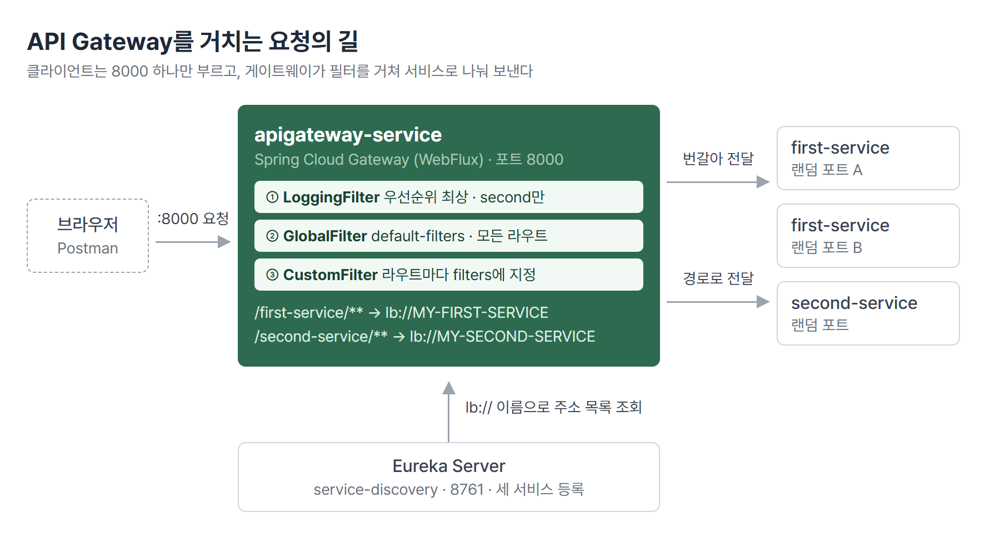
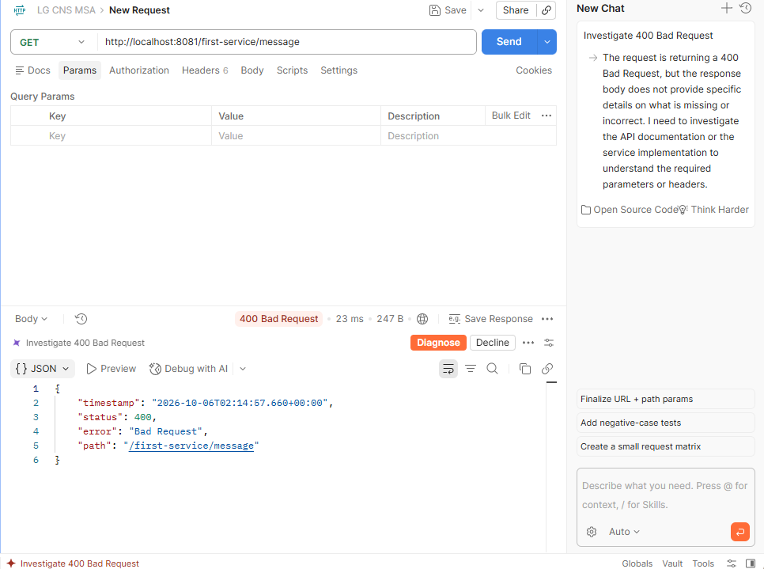
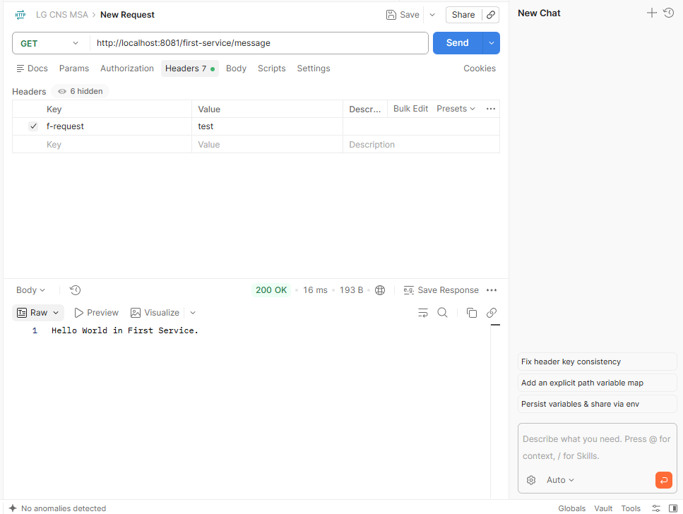
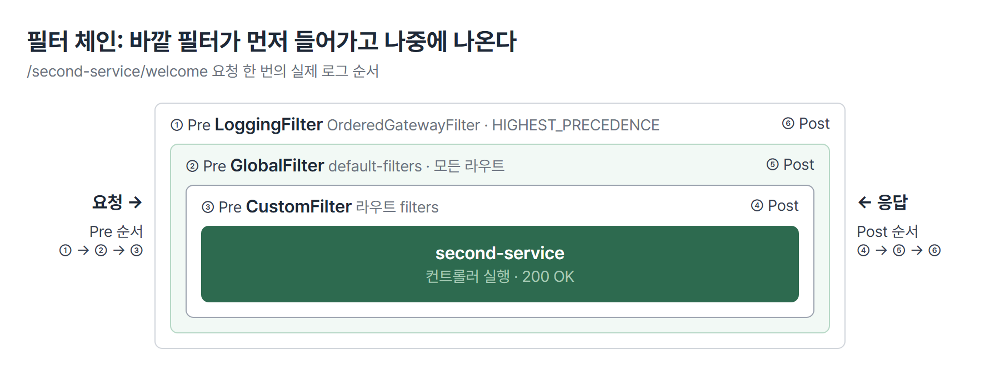
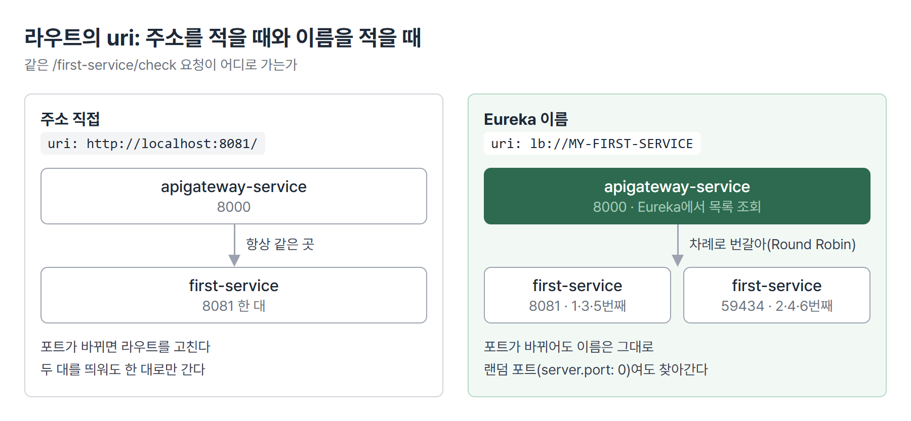

# <LG CNS 6기] MSA 3일차 TIL · API Gateway와 Filter

> TL;DR: API Gateway는 모든 요청을 한 곳(8000번)에서 받아 경로를 보고 서비스로 나눠 보내는 단일 진입점이다. 인증과 로그처럼 모든 서비스에 필요한 처리는 Gateway의 필터에 한 번만 두고, Eureka와 연결하면 주소 대신 서비스 이름으로 보내면서 여러 대에 번갈아 나눈다.

## 🗺️ 한눈에 보기

### 오늘은 무엇을 위한 작업이었나

큰 건물의 안내데스크와 같은 구조다. 방문자는 매장 위치를 몰라도 데스크에 용건만 말하면 되고, 출입 확인과 방문 기록은 데스크가 한 번에 맡는다. 서비스가 여러 개로 나뉜 구조에서 이 데스크가 **API Gateway**다. 실습의 도착점은 8000번 Gateway 하나가 필터 세 개를 거쳐 first-service와 second-service로 요청을 나눠 보내는 상태다.



> 💡 클라이언트는 Gateway 주소 하나와 경로만 알면 된다. 서비스가 몇 개인지, 몇 번 포트인지는 몰라도 된다.

### 상황별로 무엇을 쓰나

| 이런 상황이면 | 이것을 쓴다 | 절 |
|---|---|---|
| 클라이언트가 서비스 주소를 여럿 알아야 한다 | API Gateway + 라우트 | 1 · 2 |
| 서비스가 요구하는 헤더를 매번 클라이언트가 넣고 있다 | 기본 제공 필터 `AddRequestHeader` | 3 |
| 기본 제공 필터로 안 되는 처리가 필요하다 | Custom Filter | 4 |
| 모든 라우트에 같은 처리를 걸어야 한다 | `default-filters` | 4 |
| 코드를 안 고치고 필터 동작을 바꾸고 싶다 | `args` → `Config` | 4 |
| 어떤 필터가 반드시 가장 먼저 돌아야 한다 | `OrderedGatewayFilter` | 5 |
| 서비스 포트가 바뀌거나 같은 서비스가 여러 대다 | `lb://서비스이름` | 6 |

## 🧭 오늘의 학습 키워드

| 키워드 | 한 줄 정리 | 오늘 어디에 쓰였나 |
|---|---|---|
| API Gateway | 외부 요청의 단일 진입점. 경로를 보고 서비스로 전달 | 1번 절 |
| 횡단 관심사 | 인증 · 로그처럼 여러 서비스에 공통으로 걸치는 처리 | 1 · 4번 절 |
| Route | `id` + `uri` + `predicates`로 된 전달 규칙 하나 | 2번 절 |
| Predicate | 요청이 이 라우트에 해당하는지 판정하는 조건. `Path=` | 2번 절 |
| WebFlux / WebMVC | Gateway의 두 구현. 비동기(Netty)와 동기(Tomcat) | 2번 절 |
| 스레드 | 요청을 실제로 처리하는 작업 단위. 두 방식은 이것을 쓰는 법이 다름 | 2번 절 |
| 헤더 | 요청 · 응답 본문 밖에 붙는 부가 정보 | 3번 절 |
| GatewayFilter | 라우트를 지나는 요청 · 응답을 가로채 처리하는 단위 | 3 ~ 5번 절 |
| Pre / Post 필터 | 서비스 호출 전에 도는 부분과 응답이 온 뒤 도는 부분 | 4번 절 |
| `default-filters` | 모든 라우트에 공통으로 거는 필터 목록 | 4번 절 |
| `OrderedGatewayFilter` | 필터에 실행 순서 값을 붙이는 감싸개 | 5번 절 |
| Service Discovery | 서비스 위치를 이름으로 찾게 하는 구조. Eureka | 6번 절 |
| `lb://` | Eureka 이름으로 인스턴스를 골라 보내라는 uri 표기 | 6번 절 |
| Round Robin | 인스턴스를 차례로 돌아가며 고르는 분배 방식 | 6번 절 |

## ✍️ 공부한 내용

### 1. Gateway가 맡는 일

서비스를 여러 개로 나누면 클라이언트 쪽에 부담이 생긴다. first-service는 8081, second-service는 8082처럼 서비스마다 주소를 알아야 하고, 서비스가 이사 가면(포트가 바뀌면) 화면 코드를 고쳐야 한다. 로그인 확인이나 요청 기록처럼 모든 서비스가 하는 일도 서비스마다 반복된다. 여러 서비스에 공통으로 걸치는 이런 처리를 **횡단 관심사**라고 한다.

Gateway를 앞에 두면 이 두 부담이 Gateway 한 곳으로 모인다.

| | Gateway 없음 | Gateway 있음 |
|---|---|---|
| 클라이언트가 아는 주소 | 서비스마다 하나 | Gateway 하나(8000) |
| 서비스 포트가 바뀌면 | 클라이언트 코드 수정 | Gateway 설정만 수정 |
| 인증 · 로그 같은 공통 처리 | 서비스마다 반복 | Gateway 필터에서 한 번 |

대신 Gateway가 멈추면 모든 서비스에 접근할 수 없다. Gateway 자체가 띄워야 할 서버 하나가 더 생긴다는 점도 비용이다. Netflix Zuul이 예전에 이 역할을 했지만 Spring Boot 2.4부터 유지보수 상태라 Spring Cloud Gateway를 쓴다.

> 💡 Gateway는 "어디로 보낼지"를 정하고, 2일차의 Eureka는 "그 서비스가 지금 어디 있는지"를 안다.

### 2. 라우트와 두 가지 서버 방식

Gateway의 설정은 결국 라우트 목록이다. 라우트 하나는 **"이런 경로로 오면 → 여기로 보낸다"**는 짝이다.

```yaml
spring:
  cloud:
    gateway:
      server:
        webflux:
          routes:
            - id: first-service
              uri: http://localhost:8081/
              predicates:
                - Path=/first-service/**
```

- `localhost:8000/first-service/welcome`은 경로를 자르지 않고 그대로 `localhost:8081/first-service/welcome`으로 간다. 서비스 컨트롤러의 `@RequestMapping("/first-service")`가 Gateway 경로와 같아야 하는 이유다.

Gateway는 두 가지 방식으로 만들 수 있다. 라우트 쓰는 법은 거의 같고, 요청을 처리하는 **스레드**를 쓰는 방식이 다르다. 식당으로 치면 MVC는 직원 한 명이 손님 한 테이블의 음식이 나올 때까지 옆에 서 있는 방식이고, WebFlux는 주문을 받고 진동벨을 준 뒤 바로 다음 손님을 받는 방식이다.

| | WebMVC | WebFlux |
|---|---|---|
| 의존성 | `spring-cloud-starter-gateway-server-webmvc` | `spring-cloud-starter-gateway-server-webflux` |
| 라우트 위치 | `spring.cloud.gateway.server.webmvc.routes` | `spring.cloud.gateway.server.webflux.routes` |
| 처리 방식 | 동기. 요청 하나에 스레드 하나가 응답까지 붙어 있음 | 비동기. 적은 수의 스레드가 여러 요청을 번갈아 처리 |
| 서버 | Tomcat | Netty |
| 맞는 상황 | 기존 Spring MVC 코드와 함께 쓸 때 | 요청이 몰리는 진입점 |

실습은 MVC로 시작해 WebFlux로 바꿨고, 이후 필터 실습은 전부 WebFlux다. 실습 버전은 Spring Boot 4.1.1, Spring Cloud 2025.1.3, Java 17이다. Windows에서는 Eureka에 호스트 이름이 등록되는 문제가 있어서 `eureka.instance.prefer-ip-address: true`로 IP를 등록하게 했다.

### 3. 필터로 요청에 헤더 붙이기

**헤더**는 요청 본문 밖에 붙는 부가 정보다. 택배 상자 안의 물건이 본문이라면 상자 겉의 송장이 헤더다. first-service의 `/message`는 `f-request` 헤더가 있어야 응답하고, 없으면 `400 Bad Request`를 낸다.



Postman Headers에 `f-request`를 넣으면 `200 OK`로 바뀐다.



같은 헤더를 붙이는 방법이 세 가지였다.

| | 클라이언트가 직접 | Gateway 자바 코드 | Gateway yml |
|---|---|---|---|
| 하는 법 | Postman Headers에 입력 | `FilterConfig`의 `RouteLocator`에서 `addRequestHeader` | 라우트 `filters`에 `AddRequestHeader=f-request, 값` |
| 좋은 점 | 시험할 때 빠름 | 조건 분기 같은 로직을 넣을 수 있음. 오타는 컴파일 단계에서 걸림 | 짧고 라우트와 한눈에 보임 |
| 아쉬운 점 | 모든 클라이언트가 매번 넣어야 함 | 코드가 길어짐 | 잘못된 필터 이름은 실행해야 드러남 |
| 맞는 상황 | API 단독 시험 | 라우트를 코드로 조립해야 할 때 | 대부분의 고정 규칙 |

- 자바 방식은 `@Configuration`과 `@Bean`을 주석 처리하면 라우트 자체가 등록되지 않아 꺼진다. 실습은 자바 방식으로 확인한 뒤 끄고 yml로 옮겼다.
- 요청 헤더는 서비스로 가는 쪽에, 응답 헤더(`AddResponseHeader`)는 클라이언트로 돌아가는 쪽에 붙는다.

### 4. 직접 만드는 필터와 거는 범위

기본 제공 필터는 정해진 일만 한다. "요청마다 ID를 기록한다"처럼 정해지지 않은 처리는 필터를 직접 만든다. 모든 필터의 뼈대는 같다. 서비스로 넘기기 전(**Pre**)과 응답이 돌아온 뒤(**Post**) 두 자리가 있다.

```java
return (exchange, chain) -> {
    // Pre: 서비스로 넘기기 전
    return chain.filter(exchange)
            .then(Mono.fromRunnable(() -> {
                // Post: 응답이 돌아온 뒤
            }));
};
```

- `chain.filter(exchange)`가 "다음 필터로 넘긴다"는 호출이다. 마지막 필터 다음은 실제 서비스다.
- 인증 확인은 Pre, 응답 코드 기록은 Post에 둔다.

필터를 만든 뒤에는 어디에 걸지 정한다.

| | 라우트 `filters` | `default-filters` |
|---|---|---|
| 적용 범위 | 그 라우트만 | 모든 라우트 |
| 실습 예 | `CustomFilter` | `GlobalFilter` |
| 맞는 상황 | 특정 서비스에만 필요한 처리 | 모든 요청에 필요한 처리(인증, 공통 로그) |

필터에 yml로 값을 넘길 수도 있다. `args`에 적은 값이 필터 안 `Config` 클래스의 같은 이름 필드로 들어간다.

```yaml
default-filters:
  - name: GlobalFilter
    args:
      baseMessage: Spring Cloud Gateway Webflux Global Filter
      preLogger: true
      postLogger: true
```

- `preLogger`를 `false`로 바꾸면 자바 코드를 고치지 않고 Pre 로그가 꺼진다.
- `Config` 필드에서 값을 꺼내는 getter는 Lombok `@Data`가 만든다. 빠지면 컴파일이 안 된다(🔧 참조).

### 5. 필터 실행 순서

필터가 여러 개면 양파 껍질처럼 겹친다. 바깥 필터의 Pre가 먼저 돌고, 응답은 안쪽부터 나와서 바깥 필터의 Post가 마지막에 돈다.



순서를 따로 정하지 않으면 등록 방식이 정한다. `default-filters`의 GlobalFilter가 라우트의 CustomFilter보다 바깥이다. 특정 필터를 가장 바깥에 두려면 `OrderedGatewayFilter`로 감싸고 순서 값을 준다.

```java
GatewayFilter filter = new OrderedGatewayFilter((exchange, chain) -> {
    ...
}, Ordered.HIGHEST_PRECEDENCE);
```

second-service에만 LoggingFilter를 이렇게 걸고 `/second-service/welcome`을 부른 실제 로그다.

```
Logging Filter Start: request uri -> http://localhost:.../second-service/welcome
Global Filter Start: request id -> c6481a1a-1
Custom Pre Filter: request id -> c6481a1a-1
Custom Post Filter: response code -> 200 OK
Global Filter End: response code -> 200 OK
Logging Filter End: response code -> 200 OK
```

> 💡 반드시 먼저 돌아야 하는 필터(요청 기록, 인증)는 등록 순서에 맡기지 않고 순서 값을 직접 준다.

### 6. Eureka 연동과 로드밸런싱

지금까지 라우트의 `uri`에는 `http://localhost:8081/`처럼 주소를 적었다. 전화번호를 외워 거는 방식이다. 이것을 `lb://MY-FIRST-SERVICE`처럼 Eureka에 등록된 이름으로 바꾸면, Gateway가 Eureka에서 그 이름의 인스턴스 목록을 받아 하나를 골라 보낸다. 전화번호부에서 이름으로 찾는 방식이다.



- 이름은 서비스의 `spring.application.name`이 대문자로 등록된 값이다. Gateway와 서비스 모두 Eureka Client여야 한다.
- 이름으로 찾으니 서비스 포트를 정해 둘 필요가 없다. `server.port: 0`이면 실행할 때마다 빈 포트를 받는다.

8081로 떠 있던 first-service 옆에 한 대를 더 띄우고 Gateway로 `/first-service/check`를 연달아 부른 결과다.

| 호출 | 응답한 포트 |
|---|---|
| 1 · 3 · 5번째 | 8081 |
| 2 · 4 · 6번째 | 59434 |

같은 서비스를 한 대 더 띄우는 방법은 세 가지이고, 모두 "같은 프로그램을 다른 포트로 한 번 더 실행"이다.

| 방법 | 맞는 상황 |
|---|---|
| IntelliJ 실행 구성 VM 옵션 `-Dserver.port=9002` | 개발 중 IDE에서 |
| `mvn spring-boot:run "-Dspring-boot.run.jvmArguments=-Dserver.port=9003"` | 터미널에서(PowerShell은 인자 전체를 큰따옴표로) |
| `mvn package` 후 `java "-Dserver.port=9004" -jar target\...jar` | IDE가 없는 서버에 배포할 때 |

## 🧩 오늘의 자리

**과거와의 연결.** 2일차에 Eureka 서버를 띄우고 같은 서비스 여러 대를 한 이름으로 등록했다. 그때는 목록을 읽어 요청을 나눠 보내는 쪽이 없었다. Gateway의 `lb://`가 그 목록을 읽는 쪽이고, 2일차에 남긴 "이름 하나로 보낸 요청이 여러 인스턴스에 나뉘는지"가 6번 절 표로 확인됐다.

**앞으로 [확정].** 교안 목차 기준으로 Section 4 E-commerce 애플리케이션, Section 5 Users Microservice가 이어진다. Gateway와 Eureka 위에 실제 업무 서비스를 올리는 단계다. 미니 프로젝트 2는 10/30에 시작한다.

## ❓ 몰랐던 것

### Gateway가 헤더를 붙이면 좋은 점

클라이언트가 직접 넣어도 200은 나온다. 차이는 누가 그 값을 보장하느냐다. 헤더는 클라이언트가 마음대로 넣을 수 있어서, 사용자 ID 같은 값을 클라이언트에게 맡기면 다른 사람 ID를 넣어 보낼 수 있다. Gateway가 로그인 토큰을 확인한 뒤 그 결과로 헤더를 붙이면 서비스는 Gateway가 확인한 값만 받는다. 이때 Gateway는 클라이언트가 보낸 같은 이름의 헤더를 먼저 지운다. 클라이언트 코드에서 헤더 처리가 빠지고, 규칙이 바뀌어도 Gateway 한 곳만 고치면 된다는 점도 있다.

### 코드를 안 고치고 필터 동작을 바꾸는 방법

필터 클래스에 `Config` 필드를 만들어 두고, 값은 yml `args`에서 넘긴다(4번 절). 필터 코드는 `config.isPreLogger()`처럼 값을 읽어 동작을 정하므로, yml의 `true`를 `false`로 바꾸고 재시작하면 컴파일 없이 동작이 바뀐다. 같은 필터를 라우트마다 다른 값으로 걸 수도 있다.

### 로깅 필터를 가장 바깥에 두는 이유

바깥 필터가 요청을 막으면(예: 인증 실패) 안쪽 필터는 아예 실행되지 않는다. 로깅 필터가 인증 필터 안쪽에 있으면 인증에서 막힌 요청은 기록에 남지 않는다. 막힌 요청까지 남기려면 로깅 필터가 가장 먼저 받고 가장 나중에 내보내야 한다. Post 쪽이 가장 마지막이라 전체 처리 시간을 재기에도 맞는 자리다.

### 200 OK가 찍히는 곳

`response code -> 200 OK`는 Post 필터가 **Gateway 콘솔**에 남기는 로그다. first-service나 second-service의 콘솔에는 없고, 서비스 주소(8081)로 직접 부르면 Gateway를 거치지 않아 아예 찍히지 않는다. 브라우저에서 응답 코드를 보려면 개발자 도구 Network 탭에서 요청을 누른다.

### exchange를 통해서 바꿔야 한다는 말

`exchange`(`ServerWebExchange`)는 요청과 응답을 한 묶음으로 담은 객체다. 실습 필터들은 여기서 요청 · 응답을 꺼내 읽기만 했다. 요청을 바꿔서 넘기려면(헤더 추가 등) 원래 묶음을 고치는 게 아니라 `exchange.mutate()`로 바뀐 요청을 담은 새 묶음을 만들어 `chain.filter`에 넘긴다.

## 🔧 트러블슈팅

### webflux 의존성의 빨간 줄

- **문제**: pom.xml의 Gateway 의존성을 `-webmvc`에서 `-webflux`로 바꾸자 artifactId가 빨간 글씨. 같은 pom이 수업 화면에서는 정상
- **가설**: 수업 화면과 의존성 이름이나 버전이 다르다
- **원인**: 이름은 맞았다. 로컬 Maven 저장소(`~/.m2/repository`)에 webmvc 쪽만 받아져 있었고, IntelliJ는 Maven을 다시 읽기 전까지 없는 라이브러리로 표시한다
- **해결**: Maven 새로고침(`Ctrl + Shift + O`)으로 의존성을 받은 뒤 정상
- **재발 방지**: 의존성을 바꾼 직후에는 코드보다 Maven 새로고침이 먼저

### GlobalFilter 컴파일 오류

```
java: cannot find symbol
  symbol:   method getBaseMessage()
  location: variable config of type org.example.apigatewayservice.filter.GlobalFilter.Config
```

- **가설**: 수업 코드와 다르게 친 곳이 있다
- **원인**: 맞았다. 세 군데였다
  - `Config`에 `@Data`가 없어 getter가 만들어지지 않음
  - 필드 이름 `baseMassage` 오타. `@Data`를 붙여도 `getBaseMassage()`가 생김
  - Post 쪽에서 `Config.isPostLogger()`로 클래스 이름을 부름. 값은 객체 `config`에 있으므로 소문자로 불러야 함
- **해결**: 세 곳을 고친 뒤 빌드 성공, 로그 순서 확인
- **재발 방지**: Lombok이 만드는 메서드는 코드에 보이지 않는다. "메서드를 찾을 수 없음"이면 어노테이션부터 본다

## 📌 다음에 해볼 것

- [ ] yml의 `AddRequestHeader`를 다시 켜고 Gateway(8000)로 `/first-service/message`를 불러, Postman 헤더 없이 200이 나오는지 확인하기
- [ ] GlobalFilter의 `preLogger`를 `false`로 바꾸고 재시작해서 Start 로그가 사라지는지 확인하기
- [ ] Custom Filter에서 `exchange.mutate()`로 요청 헤더를 붙여 넘겨 보기

## 🔍 더 짚어둘 것

### 1. 미니 프로젝트: 1차 ReCu에 대입한 Gateway 구조

1차 미니 프로젝트(ReCu, 기술블로그 글 추천과 AI 읽기 가이드)는 서버 하나에 API 16종이 다 들어 있는 모놀리식 구조였다. Gateway 구조로 바꾸면 바뀌는 자리는 이렇다.

| 자리 | 1차 구조 | Gateway 구조라면 |
|---|---|---|
| 서비스 나누기 | 서버 하나 | 경로 앞부분 기준으로 회원(`/api/auth`, `/api/profile`), 콘텐츠(`/api/companies`, `/api/posts`), AI 가이드로 나눔 |
| 인증 | 서버의 Security 설정과 JWT 필터 | Gateway 필터에서 토큰을 한 번 확인하고 사용자 ID를 헤더로 넘김 |
| 외부 AI 장애 | Gemini 무료 등급이 혼잡 시간에 503을 내 가이드가 실패 | 가이드 서비스만 분리되어 목록 · 상세 서비스와 따로 뜨고 내려감 |
| 문제 추적 | 서버 로그 하나 | 가장 바깥 로깅 필터가 요청마다 경로 · 응답 코드를 남겨 어느 서비스에서 막혔는지 보임 |

나눌 때 판단이 필요한 지점도 있다.

- **라우트 순서**: AI 가이드 경로 `/api/posts/{id}/guide`는 콘텐츠 라우트 `Path=/api/posts/**`에도 맞는다. 먼저 걸리는 라우트가 요청을 가져가므로, 더 구체적인 가이드 라우트를 앞에 두거나 `order`로 순서를 정한다.
- **헤더 위조**: Gateway가 붙이는 사용자 ID 헤더를 서비스가 믿는 구조라면, Gateway가 클라이언트가 보낸 같은 이름의 헤더를 먼저 지워야 한다(❓ 첫 항목).
- **로드밸런싱이 푸는 범위**: 503은 외부 AI의 사용 한도 문제였다. 가이드 서비스를 여러 대로 늘려도 같은 키를 쓰면 똑같이 막힌다. 로드밸런서는 우리 서버의 부하를 나눌 뿐 외부 서비스의 한도와는 관계가 없다.
- **서비스 수**: 경로만 보고 잘게 나누면 서비스 사이 호출과 배포 대상이 늘어난다. 외부 의존(AI 가이드)처럼 따로 떼야 할 이유가 있는 기능부터 나누고, 같은 테이블을 주로 쓰는 기능은 한 서비스에 둔다.

2차 미니 프로젝트 준비에서는 이 판단을 기본값으로 잡았다. 업무 서비스 2 ~ 3개 + Eureka + Gateway, 토큰 확인은 Gateway 필터, CORS도 Gateway에서만 연다.

### 2. AI: 바이브코딩할 때 사람이 확인할 것

필터 뼈대 코드와 컴파일 오류 원인 찾기(`@Data` 누락 같은)는 AI가 빠르다. 아래 네 가지는 AI 결과를 그대로 쓰기 전에 사람이 본다.

- **설정 위치 이름**: AI나 자료가 준 Gateway 설정이 `server.webflux` · `server.webmvc`인지 본다. 같은 교안 안에서도 표는 `server.webmvc`, 캡처는 `mvc`로 달랐다. 버전마다 설정 위치가 바뀌어 왔다.
- **박혀 있는 주소**: 코드의 `localhost:포트`가 서비스 이름(`lb://`)으로 바꿀 자리인지 본다. 포트가 바뀌거나 인스턴스가 늘면 적어 둔 주소는 틀린다.
- **yml 들여쓰기**: 같은 층 키가 같은 칸에서 시작하는지 본다. `eureka.client` 안에 `instance`를 넣으면 없는 설정이 되어 오류 없이 무시된다.
- **헤더 이름**: 서비스가 요구하는 헤더와 Gateway가 붙이는 헤더를 한 표로 맞춘다. 교안 캡처는 `first-request`, 코드는 `f-request`였고 한 글자 차이로 400이 난다.

### 3. SAP ERP: Web Dispatcher와 Message Server

SAP 시스템에도 진입점과 서버 목록을 따로 두는 같은 짝이 있다. **SAP Web Dispatcher**가 HTTP 요청을 받는 진입점이고, **Message Server**가 어떤 애플리케이션 서버가 떠 있는지 목록을 관리한다. Web Dispatcher는 이 목록을 보고 요청을 여러 서버에 나눠 보낸다. Gateway와 Eureka의 관계와 같은 구조다. 실습에서는 이 두 역할을 Spring Boot 앱으로 직접 만들어 띄웠다.

태그: LG CNS 6기, 개발자, LGCNSINSPIRECAMP
