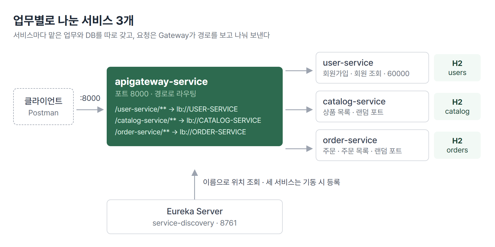
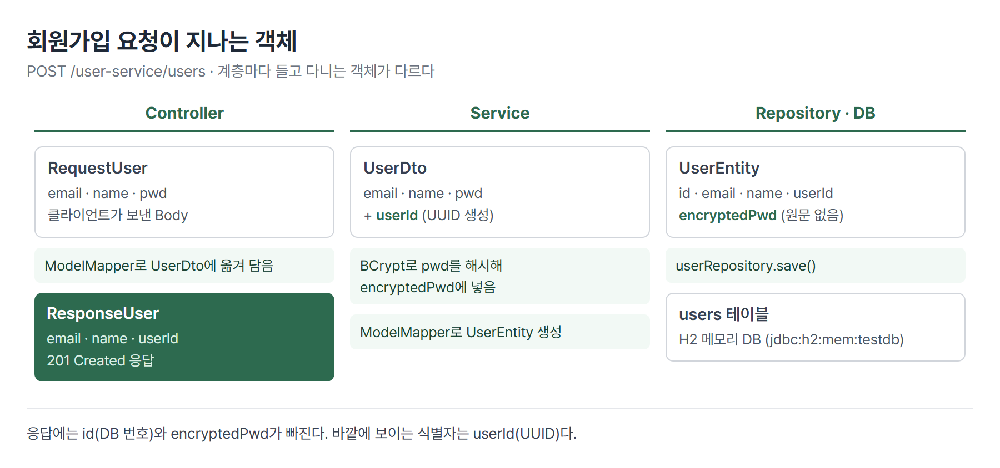
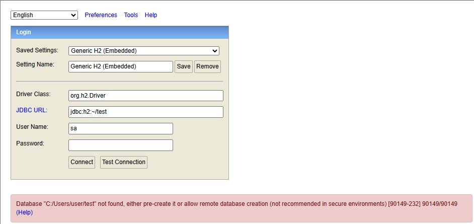
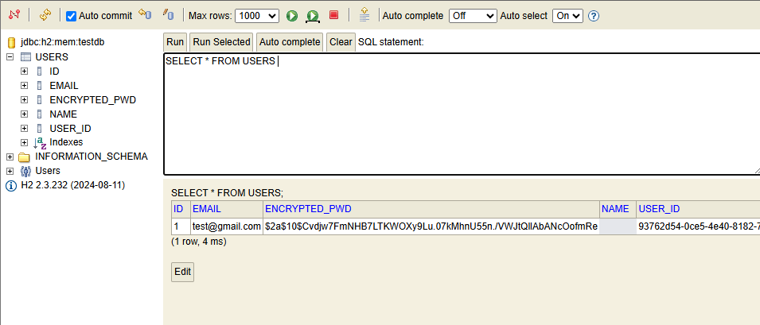
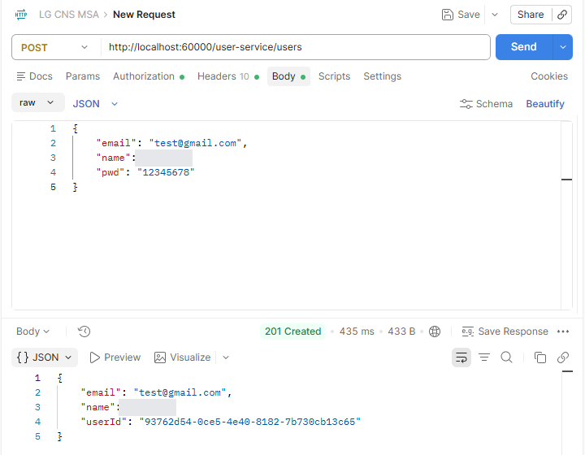
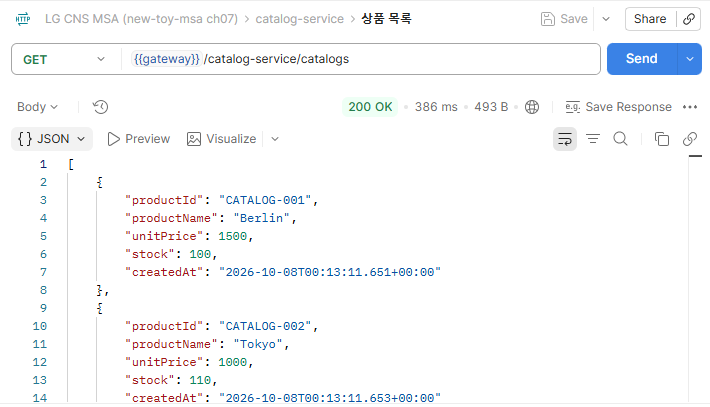
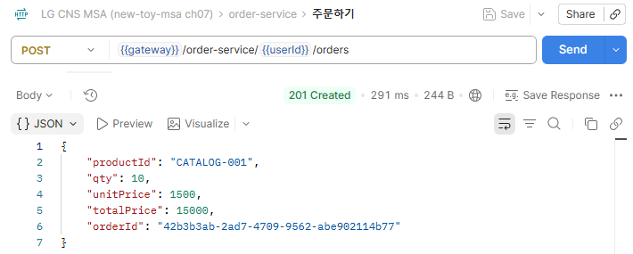
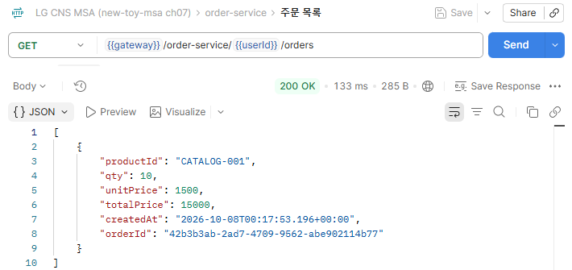

# <LG CNS 6기] MSA 4일차 TIL · 서비스 분리와 회원 서비스

> TL;DR: 쇼핑몰을 회원 · 상품 · 주문 서비스 3개로 나누고 서비스마다 DB를 따로 둔다. 회원 서비스는 요청 · 처리 · 저장 · 응답 단계마다 다른 객체를 쓰고, 비밀번호는 BCrypt 해시로만 저장한다.

## 🗺️ 한눈에 보기

### 오늘은 무엇을 위한 작업이었나

큰 쇼핑몰 하나를 업무별 매장 세 개로 나눈 구조다. 회원 매장은 가입과 회원 정보만, 상품 매장은 진열만, 주문 매장은 주문만 맡고 장부도 매장마다 따로 쓴다. 3일차에 만든 Gateway와 Eureka 위에 이 세 서비스를 올려, 회원가입 → 상품 조회 → 주문까지 요청 한 바퀴가 도는 상태가 도착점이다.



> 💡 서비스를 나누는 기준은 업무다. 회원 서비스는 회원 데이터만, 주문 서비스는 주문 데이터만 가진다.

DB는 실습용 H2 메모리 DB라 서비스를 끄면 데이터가 지워진다. 회원 서비스의 인증은 설정 파일에 적은 계정 하나로 하는 Basic 인증이다.

### 상황별로 무엇을 쓰나

| 이런 상황이면 | 이것을 쓴다 | 절 |
|---|---|---|
| 기능이 커져 한 서버에 다 넣기 어렵다 | 업무 단위로 서비스 분리 + 서비스별 DB | 1 |
| 받은 값 · 처리 중 값 · 저장 값 · 돌려줄 값이 다르다 | Request · DTO · Entity · Response 객체 분리 | 2 |
| 객체 사이에 같은 이름 필드를 옮겨 담아야 한다 | ModelMapper (`STRICT`) | 2 |
| 설정 파일 값을 코드에서 읽어야 한다 | `Environment` 또는 `@Value` | 3 |
| DB 서버 없이 서비스마다 DB가 필요하다 | H2 임베디드 DB (`jdbc:h2:mem:`) | 3 |
| 저장된 데이터를 직접 보고 싶다 | H2 콘솔 (`/h2-console`) | 3 |
| 비밀번호를 저장해야 한다 | `BCryptPasswordEncoder` | 4 |
| 아무나 API를 부르지 못하게 막는다 | Spring Security `SecurityFilterChain` | 4 |
| Gateway로 부르면 404인데 서비스 직접 호출은 된다 | Controller `@RequestMapping`을 Gateway 경로와 맞춤 | 5 |
| 서비스가 뜰 때 기본 데이터가 있어야 한다 | `data.sql` + `defer-datasource-initialization` | 5 |
| 금액처럼 서버가 정해야 하는 값이 있다 | 서비스 안에서 계산 | 5 |

## 🧭 오늘의 학습 키워드

| 키워드 | 한 줄 정리 | 오늘 어디에 쓰였나 |
|---|---|---|
| 서비스 분리 | 업무 하나를 서비스 하나가 맡도록 나누는 것 | 1번 절 |
| 서비스별 DB | 서비스마다 자기 DB를 따로 두는 구조(Database per Service) | 1번 절 |
| Inner / Outer Architecture | 업무 서비스(Inner)와 그것을 받치는 Gateway · Eureka 등(Outer) | 1번 절 |
| VO · DTO · Entity | 요청 · 응답용 객체, 계층 사이 전달 객체, 테이블과 짝인 객체 | 2번 절 |
| ModelMapper | 이름이 같은 필드끼리 값을 옮겨 담는 라이브러리 | 2 · 5번 절 |
| UUID | 겹치지 않게 만드는 무작위 식별 문자열. userId · orderId | 2 · 5번 절 |
| `Environment` · `@Value` | 설정 파일 값을 읽는 두 방법. 그때그때 조회와 필드 주입 | 3번 절 |
| H2 | 자바로 만든 가벼운 DB. 앱 안에 같이 뜨는 임베디드 방식 가능 | 3번 절 |
| JDBC URL | 어떤 DB에 어떻게 붙을지 적은 접속 주소 | 3번 절 |
| BCrypt | 비밀번호용 해시 함수. 매번 다른 Salt를 섞는다 | 4번 절 |
| 해시 | 원래 값으로 되돌릴 수 없는 단방향 변환 | 4번 절 |
| Spring Security | 요청마다 인증 · 인가를 검사하는 필터 묶음 | 4번 절 |
| Basic 인증 | 아이디 · 비밀번호를 요청 헤더에 실어 보내는 인증 방식 | 4번 절 |
| `data.sql` | 앱이 뜰 때 실행되는 초기 데이터 SQL | 5번 절 |
| `defer-datasource-initialization` | 테이블 생성 뒤로 `data.sql` 실행을 미루는 설정 | 5번 절 |

## ✍️ 공부한 내용

### 1. 업무 단위로 서비스 나누기

쇼핑몰 기능을 회원 · 상품 · 주문 세 서비스로 나누고, 각 서비스는 자기 업무의 API와 DB만 가진다.

| 서비스 | API | 메서드 | 하는 일 |
|---|---|---|---|
| catalog-service | `/catalog-service/catalogs` | GET | 상품 목록 |
| user-service | `/user-service/users` | POST | 회원가입 |
| user-service | `/user-service/users` | GET | 전체 회원 |
| user-service | `/user-service/users/{userId}` | GET | 회원 정보 + 주문 내역 |
| order-service | `/order-service/{userId}/orders` | POST | 주문하기 |
| order-service | `/order-service/{userId}/orders` | GET | 주문 목록 |

나누는 기준은 "이 데이터의 주인이 누구인가"다. 회원 서비스가 주문 내역까지 자기 DB에 저장하면 회원과 주문이라는 두 업무가 한 서비스에 엮여서 나눈 의미가 없어진다. 주문 데이터가 회원 서비스와 주문 서비스에 흩어지니 주문 내역을 한곳에서 모아 볼 수도 없다.

서비스 셋은 **Inner Architecture**(업무 로직)다. 그 바깥에서 요청을 나눠 보내는 Gateway, 서비스 위치를 아는 Eureka, 설정을 모아 두는 Config Server, 서비스끼리 메시지를 주고받는 Message Broker가 **Outer Architecture**다. 이 중 Gateway와 Eureka는 2 ~ 3일차에 만들었다.

> 💡 서비스별 DB 구조에서는 다른 서비스의 데이터를 DB로 직접 읽지 않는다. 필요하면 그 서비스에 요청한다.

### 2. 회원 서비스의 계층과 데이터 객체

회원가입 요청 하나가 Controller → Service → Repository를 지나는 동안 들고 다니는 객체가 세 번 바뀐다. 받은 값, 처리 중에 생기는 값, DB에 넣을 값, 돌려줄 값이 서로 다르기 때문이다.



| 객체 | 쓰는 자리 | 담는 것 | 맞는 상황 |
|---|---|---|---|
| `RequestUser` | Controller 입구 | email · name · pwd | 클라이언트가 보낸 값만 받을 때 |
| `UserDto` | 계층 사이 | 위 값 + userId · encryptedPwd · orders | 처리 중에 값이 늘어날 때 |
| `UserEntity` | Repository · DB | id · email · name · userId · encryptedPwd | 테이블 칸과 1:1로 맞출 때 |
| `ResponseUser` | Controller 출구 | email · name · userId | 숨길 값을 빼고 돌려줄 때 |

가입 처리의 중심은 Service의 `createUser`다. userId를 만들고, 비밀번호를 해시하고, Entity로 바꿔 저장한다.

```java
public UserDto createUser(UserDto userDto) {
    userDto.setUserId(UUID.randomUUID().toString());

    ModelMapper mapper = new ModelMapper();
    mapper.getConfiguration().setMatchingStrategy(MatchingStrategies.STRICT);
    UserEntity userEntity = mapper.map(userDto, UserEntity.class);
    userEntity.setEncryptedPwd(passwordEncoder.encode(userDto.getPwd()));

    userRepository.save(userEntity);
    return mapper.map(userEntity, UserDto.class);
}
```

- ModelMapper는 필드 이름을 보고 값을 옮긴다. `STRICT`는 이름이 정확히 같을 때만 옮겨서, 비슷한 이름끼리 잘못 짝지어지는 일을 막는다.
- 바깥에 보이는 식별자는 DB가 매기는 `id`가 아니라 UUID인 `userId`다. `id`는 1, 2, 3처럼 순서대로 늘어서 다른 회원 번호를 짐작할 수 있다.

### 3. 설정 값과 H2 임베디드 DB

`application.yml`에 적은 값(예: `greeting.message: Welcome to the Simple E-commerce.`)을 코드에서 읽는 방법이 둘이다.

| | `Environment` | `@Value` |
|---|---|---|
| 쓰는 법 | `env.getProperty("greeting.message")` | 필드에 `@Value("${greeting.message}")` |
| 읽는 때 | 부를 때마다 키로 조회 | 빈이 만들어질 때 필드에 주입 |
| 맞는 상황 | 키를 그때그때 골라 읽을 때(`local.server.port` 등) | 고정 설정 몇 개를 클래스 하나로 묶을 때 |

회원 서비스의 `/welcome`은 `@Value`를 담은 `Greeting` 클래스를 주입받아 환영 메시지를 돌려준다. `/health-check`는 실행 중에 정해진 포트를 `Environment`로 읽는다.

H2는 별도 DB 서버를 설치하지 않고 앱 안에서 같이 뜨는 DB다. 서비스마다 DB를 둬야 하는 실습에서 DB 서버를 여러 개 띄우는 수고를 덜어 준다. `mem` 방식이라 데이터는 메모리에만 있고, 서비스를 재시작하면 비워진다.

```yaml
spring:
  h2:
    console:
      enabled: true
      path: /h2-console
  datasource:
    driver-class-name: org.h2.Driver
    url: jdbc:h2:mem:testdb;DB_CLOSE_DELAY=-1;
    username: sa
    password:
  jpa:
    hibernate:
      ddl-auto: update
```

- `DB_CLOSE_DELAY=-1`은 연결이 모두 끊겨도 서비스가 떠 있는 동안 메모리 DB를 지우지 않게 하는 옵션이다.
- `ddl-auto: update`는 Entity를 보고 테이블을 만든다. `UserEntity`의 `@Table(name = "users")`가 `USERS` 테이블이 된다.
- 콘솔은 `http://localhost:60000/h2-console`(서비스 포트 + 경로)로 연다.

콘솔 로그인 화면의 JDBC URL 기본값은 `jdbc:h2:~/test`다. 그대로 접속하면 DB가 없다는 오류가 난다.



H2는 1.4.198부터 보안 문제로 접속 시점에 없는 DB를 자동으로 만들지 않는다. 주소가 틀리면 빈 DB가 새로 생기는 대신 `not found` 오류가 나는 이유다. 설정 파일의 주소인 `jdbc:h2:mem:testdb`로 바꾸면 접속된다. 기동 클래스의 `CommandLineRunner`가 서비스가 뜰 때 접속 URL을 콘솔에 찍어 주므로 거기서 확인할 수도 있다.

### 4. 비밀번호 해시와 Spring Security

비밀번호 원문을 DB에 두면 DB가 유출됐을 때 비밀번호가 그대로 드러난다. 그래서 되돌릴 수 없는 값으로 바꿔 저장하고, 로그인 때는 입력값을 같은 방식으로 바꿔 비교한다. 이 변환을 **해시**라고 하고, `BCryptPasswordEncoder`가 그 일을 한다. 기동 클래스에 `@Bean`으로 등록해 Service가 주입받아 쓴다.



- `12345678`로 가입한 회원의 `ENCRYPTED_PWD`가 `$2a$10$...`로 저장된다. 원문은 어디에도 없다.

Spring Security는 요청이 Controller에 닿기 전에 인증을 검사한다. 규칙은 `SecurityFilterChain`을 돌려주는 `@Bean` 하나에 모은다.

```java
@Bean
protected SecurityFilterChain configure(HttpSecurity http) throws Exception {
    http.csrf((csrf) -> csrf.disable())
        .authorizeHttpRequests(auth -> auth
                .requestMatchers("/h2-console/**").permitAll()
                .anyRequest().authenticated())
        .httpBasic(Customizer.withDefaults())
        .headers((headers) -> headers
                .frameOptions((frameOptions) -> frameOptions.sameOrigin()));
    return http.build();
}
```

- H2 콘솔만 인증 없이 열고 나머지는 인증을 요구한다. 인증 없이 회원가입을 부르면 `401 Unauthorized`다.
- `frameOptions().sameOrigin()`이 없으면 H2 콘솔 화면이 깨진다. 콘솔이 화면을 frame으로 나눠 그리는데 Security는 기본으로 frame 표시를 막는다.
- Basic 인증 계정은 `spring.security.user`에 적는다. 비밀번호 칸에도 원문 대신 BCrypt 값을 넣었다.

Postman Authorization에 Basic Auth 계정을 넣고 회원가입을 보내면 `201 Created`가 온다. 응답에는 비밀번호가 없고 userId가 있다.



### 5. 회원 조회와 상품 · 주문 서비스

회원 서비스에 조회 API 두 개가 붙는다. 전체 회원 목록(`GET /users`)과 회원 한 명의 정보 + 주문 목록(`GET /users/{userId}`)이다. 응답에 주문 목록을 담으려고 `ResponseUser`에 `List<ResponseOrder> orders` 필드를 두었다.

Gateway에 `/user-service/**` 라우트를 등록하면 문제가 하나 생긴다. 서비스를 직접 부르면 되는데 Gateway로 부르면 404다. Gateway는 경로를 자르지 않고 그대로 넘기므로, `localhost:8000/user-service/health-check`는 회원 서비스에 `/user-service/health-check`로 도착한다. Controller가 `/health-check`만 받고 있으면 맞는 주소가 없다.

```java
@RestController
@RequestMapping("/user-service")
public class UserController { ... }
```

- Controller 전체 경로 앞에 `/user-service`를 붙여 Gateway 경로와 맞췄다. 직접 부를 때도 `localhost:60000/user-service/users`처럼 접두어가 붙는다.
- 3일차 first-service의 `@RequestMapping("/first-service")`와 같은 이유다.

상품 서비스는 뜰 때 상품 3개를 미리 넣어 둔다. `data.sql`에 insert를 적어 두면 앱 기동 시 실행된다.

```sql
insert into catalog(product_id, product_name, stock, unit_price)
values('CATALOG-001', 'Berlin', 100, 1500);
```

Spring Boot 2.5부터 `data.sql`이 Hibernate의 테이블 생성보다 먼저 실행된다. 테이블이 없는 상태에서 insert가 돌아 실패한다. 그래서 `spring.jpa.defer-datasource-initialization: true`로 `data.sql` 실행을 테이블 생성 뒤로 미룬다. 상품 서비스의 `ddl-auto`는 `create-drop`이라 뜰 때마다 테이블을 새로 만들고 3개를 다시 넣는다.



주문 서비스는 주문을 받으면 주문번호(UUID)를 만들고 총액을 직접 계산해 저장한다.

```java
orderDto.setOrderId(UUID.randomUUID().toString());
orderDto.setTotalPrice(orderDto.getQty() * orderDto.getUnitPrice());
```

- 요청 Body는 `productId` · `qty` · `unitPrice` 세 개다. `totalPrice`와 `orderId`는 클라이언트가 보내지 않는다.
- 가격 계산은 주문 서비스가 맡은 업무라서 주문 서비스 안에서 한다.



같은 userId로 주문 목록을 부르면 방금 넣은 주문이 나온다.



- 회원 서비스의 회원 1명 조회는 아직 `orders: []`를 돌려준다. 회원 서비스가 주문 서비스에 주문 내역을 요청하는 코드가 없어서다(1번 절의 💡).

## 🧩 이어지는 내용

- 3일차 Gateway 라우트는 연습용 first · second 서비스를 가리켰다. 같은 `lb://서비스이름` 방식으로 user · catalog · order 서비스를 붙였다.
- 서비스 안쪽의 Controller · Service · Repository · Entity 구조는 30일차 JPA 실습과 같다. 그 구조가 서비스마다 하나씩 들어 있다.
- 교안의 다음 순서는 Section 7 Users Microservice ②(로그인), Section 8 Configuration Service, Section 9 Spring Cloud Bus다.
- 2차 사후평가는 10/29, 미니 프로젝트 2는 10/30에 시작한다.

## ❓ 몰랐던 것

### 응답을 Entity가 아니라 ResponseUser로 따로 두는 이유

`UserEntity`에는 `id`(DB가 매긴 순번)와 `encryptedPwd`(비밀번호 해시)가 들어 있다. Entity를 그대로 응답하면 이 둘이 JSON으로 나간다. 해시는 되돌릴 수 없어도 공격자가 대입 공격을 시도할 재료가 되고, 순번은 다른 회원의 번호를 짐작하게 한다.

API 응답 모양이 테이블에 묶이는 문제도 있다. 테이블 칸 이름을 바꾸면 응답 JSON의 키가 바뀌고, 그 키를 읽던 화면이 깨진다. `ResponseUser`를 따로 두면 테이블이 바뀌어도 응답 모양은 그대로 둘 수 있다. 클라이언트에게 필요한 email · name · userId만 골라 보내는 자리이기도 하다.

### JDBC URL의 콜론 구조

`jdbc:h2:mem:testdb`는 콜론으로 나뉜 네 칸이다.

| 칸 | 값 | 뜻 |
|---|---|---|
| 1 | `jdbc` | 자바의 DB 접속 규약으로 연결한다 |
| 2 | `h2` | DB 종류 |
| 3 | `mem` | 저장 방식. 메모리 |
| 4 | `testdb` | DB 이름 |

기본값 `jdbc:h2:~/test`는 셋째 칸이 `mem`이 아니라 파일 경로(`~/test`)다. "사용자 폴더의 test라는 DB 파일을 열어라"는 뜻이라 `C:/Users/user/test`를 찾다가 없어서 실패한다. 회원 서비스는 메모리에 `testdb`를 만들었으므로 같은 주소를 적어야 같은 DB에 붙는다. MySQL이면 `jdbc:mysql://호스트:포트/DB이름`처럼 둘째 칸 뒤 모양이 DB마다 다르다.

### 같은 비밀번호인데 저장값이 다른 이유

같은 `12345678`로 두 명이 가입하면 저장값은 다르다. 이유는 복호화와 관계없다. BCrypt는 해시라서 원래 값으로 되돌리는 단계(복호화) 자체가 없다.

값이 달라지는 이유는 **Salt**다. BCrypt는 해시할 때마다 무작위 값(Salt)을 새로 만들어 비밀번호에 섞는다. 저장값 `$2a$10$` 뒤 22글자가 그 Salt이고 나머지가 해시 결과다. `10`은 해시를 몇 번 반복할지 정하는 비용 값이다. 로그인 때는 저장값에서 Salt를 꺼내 입력값을 같은 방식으로 해시한 뒤 결과를 비교한다(`matches`). 같은 비밀번호여도 Salt가 다르니, 한 사람의 비밀번호를 알아내도 다른 사람 것을 함께 알아낼 수 없다.

## 📌 다음에 해볼 것

- [ ] 같은 비밀번호로 두 계정을 가입하고 H2 콘솔에서 `ENCRYPTED_PWD`의 Salt 부분이 다른지 확인하기
- [ ] 주문한 뒤 상품 목록의 `stock`이 줄었는지 확인하고, 수량 반영이 어느 서비스의 일인지 정리하기
- [ ] 회원가입 Controller의 `@RequestBody` 앞에 `@Valid`를 붙이고 잘못된 Body를 보냈을 때 응답 코드가 어떻게 바뀌는지 보기

## 🔍 더 짚어둘 것

### 1. 미니 프로젝트: 요청 · 응답 객체를 API마다 나누는 판단

1차 미니 프로젝트(ReCu)는 응답을 봉투 없이 DTO 그대로 보냈다. 이때 기업 목록과 기업 상세가 같은 응답 클래스(`CompanyResponseDTO`)를 쓰게 뼈대가 잡혀 있었고, 두 사람이 이 클래스를 각자 채우다가 두 PR이 충돌했다. 목록용 응답 클래스를 따로 만들어 해결했다.

회원 서비스가 `RequestUser`와 `ResponseUser`를 따로 둔 것과 같은 판단이다. 응답 클래스 하나를 여러 API가 같이 쓰면, 한 API에 필드를 더할 때 다른 API 응답까지 바뀐다. 2차 준비에서는 이렇게 정리된다.

- **응답 클래스**: 뼈대 단계에서 API마다 따로 만든다. 같은 필드라도 공유하지 않는다.
- **서비스 경계**: 화면 하나가 여러 서비스의 데이터를 모아야 하는지 먼저 본다. 회원 정보와 주문 내역을 한 화면에 보여 주면 회원 서비스가 주문 서비스를 불러야 하고, 그 호출이 실패할 때의 응답도 정해야 한다.

### 2. AI: 바이브코딩할 때 사람이 확인할 것

Controller · Service · Entity 뼈대는 AI가 빠르게 만든다. 아래는 결과를 그대로 쓰기 전에 사람이 본다.

- **Entity 직접 반환**: Controller가 Entity를 그대로 돌려주는지 본다. 코드가 짧아서 생성 결과에 섞이기 쉽다. 그러면 `encryptedPwd` · `id`가 응답에 나가고, 테이블 칸 이름이 곧 API 키가 된다(❓ 첫 항목).
- **비밀번호 저장 형태**: DB를 직접 열어 비밀번호 칸이 `$2a$` 같은 해시로 시작하는지 본다. 코드만 읽어서는 encode를 빠뜨린 경로를 놓칠 수 있다.
- **서버가 정할 값**: 주문 Body에 `unitPrice`가 있어서 클라이언트가 단가를 바꿔 보내면 그 값으로 총액이 계산된다. 상품 가격의 주인은 상품 서비스다. 가격 · 권한처럼 서버가 정할 값을 클라이언트가 보내는 구조인지 본다.
- **검증 어노테이션**: `RequestUser`에 `@NotNull` · `@Email`이 붙어 있어도 Controller 파라미터에 `@Valid`가 없으면 검사가 돌지 않는다. 비밀번호를 빼고 보내면 400이 아니라 500(`rawPassword cannot be null`)이 난다.

### 3. SAP ERP: 모듈은 나뉘어도 DB는 하나

SAP ERP는 MM(구매 · 자재) · SD(판매) · FI(회계)처럼 업무 모듈이 나뉘어 있지만 DB는 하나를 같이 쓴다. 자재 마스터(MARA) 하나를 구매와 판매가 같은 테이블에서 읽는다. 그래서 모듈끼리 같은 데이터를 본다.

MSA는 서비스마다 DB를 따로 둬서 다른 서비스 데이터가 필요하면 그 서비스에 요청해야 한다. 회원 1명 조회의 `orders: []`가 그 경계가 드러난 자리다. 서비스를 따로 고치고 배포할 수 있는 대신, 데이터를 맞추는 일은 서비스 간 호출로 직접 해야 한다.

태그: LG CNS 6기, 개발자, LGCNSINSPIRECAMP
