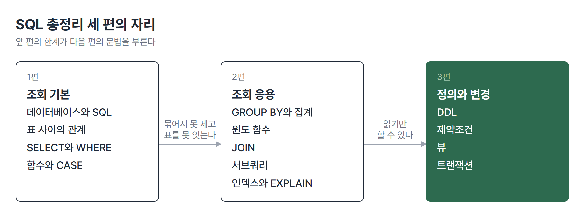
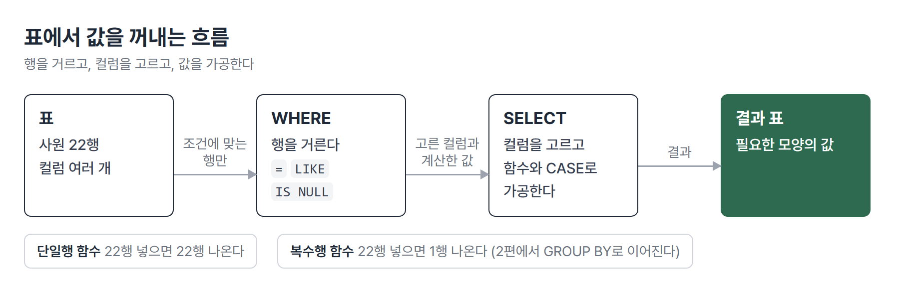

# <LG CNS 6기] SQL 총정리 (1/3) · 조회 기본

> TL;DR: SQL의 첫 덩어리는 데이터를 읽는 문법이다. 표에서 원하는 행과 컬럼을 고르고(WHERE, SELECT), 꺼낸 값을 함수로 바꾼다. 이 편의 끝에서 "묶어서 세기"와 "나뉜 표 함께 보기"가 안 되는 지점을 만나고, 그 한계가 2편의 GROUP BY와 JOIN을 부른다.

## 이 시리즈에 대해

LG CNS Inspire Camp의 SQL 파트에서 배우는 것을 주제 순서로 정리한 글이다. 날짜나 일차는 쓰지 않는다. 앞의 한계가 다음 문법을 부르는 순서가 중요하기 때문이다.

| 편 | 주제 | 다루는 것 |
|---|---|---|
| 1편 | 조회 기본 | 데이터베이스, 표 사이의 관계, SELECT와 WHERE, 함수와 CASE |
| 2편 | 조회 응용 | GROUP BY와 집계, 윈도 함수, JOIN, 서브쿼리, 인덱스와 EXPLAIN |
| 3편 | 정의와 변경 | DDL, 제약조건, 뷰, 트랜잭션 |

프로그래밍을 처음 접해도 읽을 수 있게 용어는 처음 나올 때 풀어 쓴다.



## 이 편의 지도

SQL로 데이터를 읽는 일은 세 단계로 나뉜다. **표에서 행을 거르고, 컬럼을 고르고, 꺼낸 값을 가공한다.**



| 절 | 다루는 것 | 답하는 질문 |
|---|---|---|
| 1 | 데이터베이스와 SQL | 파일 저장으로는 왜 부족한가 |
| 2 | 표 사이의 관계 | 표 여러 개는 어떻게 이어져 있나 |
| 3 | SELECT와 WHERE | 원하는 컬럼과 행을 어떻게 집나 |
| 4 | 함수와 CASE | 꺼낸 값을 어떻게 바꾸나 |
| 5 | 여기서 막힌다 | 한 번의 조회로 안 되는 것은 무엇인가 |

## 1. 데이터베이스와 SQL

### 파일로 저장하면 생기는 문제

프로그램마다 자기 파일에 데이터를 따로 저장하면 같은 내용이 파일마다 조금씩 다르게 적힌다. 가계부를 엑셀 파일 여러 개로 나눠 쓰는 상황과 같다. 데이터가 **중복**되고, 데이터가 그 파일을 만든 프로그램에 **종속**된다. 메모리 위 `List`에만 데이터를 둔 프로그램은 껐다 켜면 데이터를 잃는데, 이 역시 저장 장소가 프로그램 안에 묶여 있기 때문이다.

이 문제를 풀려고 나온 것이 **DBMS**(Database Management System)다. 여러 응용 프로그램이 함께 접근하는 통합된 데이터 집합이 **데이터베이스**이고, 그것을 한곳에서 관리하는 소프트웨어가 DBMS다.

### 표로 관리하는 방식, RDBMS

DBMS 중 데이터를 **표(테이블)**로, 표 사이의 **관계**로 관리하는 방식이 **RDBMS**(관계형)다. 데이터를 가장 작은 논리 단위로 만드는 것을 **정규화**라고 한다.

관계형이 전부는 아니다. 비정형 데이터를 다루는 NoSQL, 객체지향 DB도 있다. 이 시리즈는 관계형과 그 언어인 SQL을 다룬다.

### 제품과 도구

DB 제품은 여러 가지다. 유명한 Oracle은 비싸고, **MariaDB**는 MySQL과 같은 개발자가 만들어 문법이 비슷하다. 이 시리즈의 예제는 MariaDB 기준이다. 설치는 서버(MariaDB, 데이터를 관리하는 본체)와 클라이언트(HeidiSQL, 접속해서 SQL을 쓰고 결과를 보는 창)를 따로 한다.

### SQL의 네 갈래

SQL은 하는 일에 따라 네 갈래로 나뉜다.

| 갈래 | 이름 | 하는 일 | 이 시리즈 |
|---|---|---|---|
| 검색 | SELECT | 데이터를 읽는다 | 1편, 2편 |
| 정의 | DDL | 표의 구조를 만들고 고친다 | 3편 |
| 조작 | DML | 데이터를 넣고 고치고 지운다 | 3편 예제 안에서 쓰임 |
| 제어 | DCL | 변경을 확정하거나 되돌린다 | 3편 |

COMMIT과 ROLLBACK은 DCL에 넣기도 하고 TCL(트랜잭션 제어)로 따로 부르기도 한다.

## 2. 표 사이의 관계

### 표의 생김새

이 시리즈의 예제는 두 묶음의 표를 쓴다. 사원과 부서를 담은 표들, 그리고 학과, 학생, 과목, 교수, 수강, 성적을 담은 학사 표 6개다. 표를 만드는 문장은 3편에서 다루고, 여기서는 생김새만 본다.

```sql
CREATE TABLE EMPLOYEE
(EMP_ID   CHAR(3) PRIMARY KEY,
 EMP_NAME VARCHAR(20) NOT NULL,
 ...
 DEPT_ID  CHAR(2) REFERENCES DEPARTMENT(DEPT_ID),
 CHECK (MARRIAGE IN ('Y','N')),
 UNIQUE(EMP_NO)
);
```

- 컬럼마다 타입과 제약을 함께 선언한다. `PRIMARY KEY`(기본키)는 행 하나를 가리키는 이름표이고, `NOT NULL`은 비워 둘 수 없다는 뜻이다.
- `DEPT_ID`는 `DEPARTMENT` 표의 `DEPT_ID`를 **참조**한다. 사원 표의 부서 번호는 부서 표에 있는 값이어야 한다는 선언이고, 표와 표가 관계로 묶이는 자리가 여기다.

### ERD

**ERD**는 표(엔티티)를 상자로, 관계를 선으로 그린 그림이다. 
- **기본키(PK)**는 상자 위쪽 칸에 따로 표시된다.
- 다른 표를 참조하는 컬럼에는 **외래키(FK)**가 붙는다. FK는 **여럿인 쪽**에 붙는다. 학과 하나에 학생이 여럿이므로, 학생 표에 학과 번호(FK)가 있다.

> 💡 두 표를 어느 쪽이 1이고 어느 쪽이 N인지 먼저 정해야 ERD를 그릴 수 있다. 그림은 도구가 그려도, 관계를 정하는 일은 사람의 몫이다.

이 관계가 이후 모든 조회의 배경이다. 표가 나뉘어 있다는 것은 사원 표만 봐서는 부서 이름을 알 수 없다는 뜻이다. 이 불편은 5절에서 다시 나온다.

## 3. SELECT와 WHERE

### 문법의 뼈대

데이터를 읽는 문장의 전체 모양은 이렇다.

```sql
SELECT      distinct 컬럼명 | 컬럼명 | * | 표현식 | 별칭
FROM        테이블의 이름
[WHERE]     행의 제한
[GROUP BY]  데이터를 그룹으로 묶을 때
[HAVING]    그룹에 대한 조건
[ORDER BY]  정렬(ASC, DESC)
```

- 대괄호는 생략할 수 있다는 뜻이다. 최소 형태는 `SELECT`와 `FROM` 두 줄이다.
- 이 편에서 쓰는 것은 `SELECT`, `FROM`, `WHERE`, `ORDER BY`다. `GROUP BY`와 `HAVING`은 2편에서 다룬다.

키워드는 대소문자를 가리지 않지만 **데이터는 대소문자를 구분**한다. 그리고 별칭에 공백이나 특수문자가 들어가면 따옴표로 감싸야 한다.

### 컬럼 자리의 표현식

컬럼 자리에는 컬럼 이름 외에 **표현식**(계산식)도 들어갈 수 있고, `AS`로 결과 컬럼에 이름을 붙인다.

```sql
SELECT emp_name,
       salary,
       (salary * bonus_pct) * 12 AS '연봉'
FROM   employee;
```

그런데 이 쿼리를 실행하면 일부 사원의 연봉 칸이 비어서 나온다. 보너스 비율이 없는 사원들이다.

### NULL과 계산

값이 없다는 표시가 **NULL**이다. NULL은 0이 아니다. NULL이 수식에 들어가면 **결과 전체가 NULL**이 된다. 에러 없이 결과 칸만 비어서 나오므로, 쿼리는 성공한 것처럼 보이고 행이 많으면 알아채기 어렵다.

`IFNULL(값, 대신 쓸 값)`은 값이 NULL일 때 두 번째 인자를 돌려준다.

```sql
SELECT emp_name,
       salary,
       (salary + (salary * IFNULL(bonus_pct, 0))) * 12 AS '연봉'
FROM   employee;
```

보너스가 NULL인 사원은 0으로 보고 계산하므로 모든 행의 연봉이 나온다. 대가는 "없는 값은 0으로 본다"는 판단이 쿼리 안에 들어간다는 것이다. 0으로 볼지 다른 값으로 볼지는 업무가 정한다.

WHERE에서도 같은 성질이 이어진다. NULL인 행은 `= NULL`로 잡히지 않고 전용 문법 **`IS NULL`**로 찾는다.

```sql
-- 부서배치를 받지 않은 사원
SELECT * FROM employee WHERE dept_id IS NULL;
```

> 💡 NULL은 "0"도 "빈 문자열"도 아닌 "없음"이다. 계산에서는 결과를 삼키고, 비교에서는 `=`로 잡히지 않는다.

### WHERE의 연산자

행을 거르는 연산자는 같은 조건을 여러 표기로 쓸 수 있다.

| 연산자 | 뜻 |
|---|---|
| `=` `>=` 와 AND·OR·NOT | 비교와 논리 조합 |
| `BETWEEN a AND b` | `>= a AND <= b`의 축약 |
| `IN (a, b)` | `= a OR = b`의 축약 |
| `LIKE` | `%`(여러 문자), `_`(한 문자) 패턴 검색 |
| `IS NULL` | NULL인 행 검색 전용 |

급여가 350만~550만인 사원은 두 표기가 같은 결과를 낸다.

```sql
WHERE salary >= 3500000 AND salary <= 5500000;
WHERE salary BETWEEN 3500000 AND 5500000;
```

### LIKE와 이스케이프

패턴 검색에서 기호와 문자가 부딪히는 자리가 있다. 메일 아이디에서 `_` 앞이 3자리인 사원을 찾는 경우다.

```sql
WHERE emp_name LIKE '김%';       -- 김씨 성 검색
WHERE email LIKE '___\_%';       -- 메일 아이디의 _ 앞이 3글자인 사원
```

- `_`는 LIKE 안에서 "아무 문자 하나"를 뜻하는 기호인데, 이메일 데이터에는 문자 `_`가 실제로 들어 있다. 문자 그대로의 `_`를 찾으려면 `\_`로 **이스케이프**한다. `___\_%`는 "아무 3글자, 밑줄 하나, 나머지"다.
- 이스케이프 없이 `____%`로 쓰면 "아무 4글자 이상"이 된다. 에러 없이 **더 많은 행이 통과**해서 결과만 봐서는 맞는 것처럼 보인다.

### 에러 없이 통과하는 경우

WHERE는 틀려도 에러가 나지 않는 경우가 많다.

**조건이 하나 빠져도 돌아간다.** "여학생 중 휴학 중인 학생"은 조건이 둘이다. `absence_yn = 'Y'`만 쓰면 에러 없이 결과가 나오고, 예상 출력과 행 수가 우연히 같으면 틀린 것을 모른다. 여학생 조건은 주민번호 뒷자리 첫 숫자를 LIKE로 거른다. `student_ssn LIKE '______-2%'`는 아무 6글자 뒤에 `-2`가 오는 패턴이다. 학과 코드는 직접 적지 않고 괄호 안 SELECT로 학과 표에서 조회하며, 이 괄호 안 SELECT가 서브쿼리다(2편).

**날짜 컬럼에 LIKE가 통한다.** 입학일은 날짜 타입인데 `entrance_date LIKE '2002%'`가 돌아간다. 비교하는 순간 날짜가 '2002-03-01' 같은 **문자열로 바뀌어** 패턴과 대조되기 때문이다.

**숫자 컬럼에 문자를 비교해도 돌아간다.** 정원 컬럼은 숫자(INT)인데 `capacity >= '20'`처럼 따옴표를 붙인 문자와 비교해도 결과가 나온다. 문자를 숫자로 바꿔서 비교해 주기 때문이다. 반대로 부서 번호(`dept_id = '90'`)는 CHAR 컬럼이라 따옴표가 정석이다. 컬럼 타입을 보고 따옴표를 정한다. 자바에서 `int`와 `"20"`이 만나면 컴파일러가 막지만 SQL은 변환해서 진행한다.

> 💡 SQL은 틀린 조건도 성실하게 실행한다. 결과가 나왔다는 것은 맞다는 증거가 못 된다. 예상 행 수와 실제 행 수를 맞춰 보고, 문제의 조건 개수와 쿼리의 조건 개수를 대조한다.

## 4. 함수와 CASE

### 단일행 함수와 복수행 함수

함수는 큰 프로그램에서 자주 쓰는 부분을 떼어 놓은 작은 서브프로그램이다. 자바의 메서드와 같은 개념이고, 이름을 부르면 값을 돌려준다.

SQL 함수는 두 갈래다. 기준은 이름이나 용도가 아니라 **넣은 행 수와 나오는 행 수**다.

| 갈래 | 넣으면 | 나오면 | 예 |
|---|---|---|---|
| 단일행 함수 | 22행 | 22행 | LENGTH, SUBSTRING, ROUND, IF |
| 복수행 함수 | 22행 | 1행 | COUNT, MIN, MAX, AVG, SUM |

이 구분이 앞에 나오는 이유는 5절에서 드러난다. 복수행 함수는 여러 행을 하나로 뭉치므로 일반 컬럼과 나란히 놓을 수 없다.

### 문자열: 길이, 자르기, 찾기

**길이를 세는 함수가 둘이다.**

```sql
SELECT LENGTH('임정섭')       -- 바이트 수
      ,CHAR_LENGTH('임정섭')   -- 글자 수
      ,LENGTH('jslim');        -- 영문은 두 값이 같다
```

영문과 숫자는 한 글자가 1바이트라 두 함수의 값이 같다. 한글은 인코딩에 따라 한 글자가 여러 바이트라서 갈린다. 한글 이름에 `LENGTH`를 쓰고 3과 비교하면 에러 없이 **아무 행도 안 나오거나 전부 나온다.** 영문으로 테스트하면 차이가 안 드러나서 놓치기 쉽다.

**자르기와 찾기.** `SUBSTRING(문자열, 시작, 길이)`이 기본이고, 앞에서 자르면 `LEFT`, 뒤에서 자르면 `RIGHT`다. SQL의 문자열 위치는 **1부터** 센다. 자바 배열이 0부터인 것과 다르다. 자를 위치를 미리 모르면 `INSTR`로 찾는다. 찾는 문자열이 몇 번째에 있는지 숫자로 돌려준다. 이메일에서 아이디만 뽑는 경우가 예다.

```sql
SELECT LEFT(EMAIL, INSTR(EMAIL, '@') - 1)   -- @의 위치를 찾아 그 앞까지 왼쪽에서 자른다
      ,SUBSTRING_INDEX(EMAIL, '@', 1)       -- 같은 일을 한 번에 한다
FROM   employee;
```

`-1`은 @ 자신을 빼려고 붙인다. `SUBSTRING_INDEX`는 구분자 기준으로 몇 번째 조각을 가져올지 지정하며, 세 번째 인자가 음수면 뒤에서부터 센다. `CONCAT`은 문자열을 이어 붙이고, `TRIM`은 공백을 지운다.

> 💡 같은 결과를 내는 길이 여러 개다. 짧은 쪽과 단계가 보이는 쪽 중 무엇을 고를지는 읽는 사람이 정한다.

### 타입 변환은 CAST

숫자와 문자를 섞으려면 타입을 맞춘다. 타입 이름을 함수처럼 `INT(...)`로 부르는 표기는 없고, **`CAST(값 AS 타입)`**이라는 전용 문법을 쓴다. `INT`는 함수 이름이 아니라 타입 이름이라 괄호를 붙여 부를 대상이 아니기 때문이다. 예를 들어 평균을 정수로 바꿀 때는 `CAST(AVG(AMOUNT) AS INT)`다. 자바의 `(int)` 캐스팅이 메서드가 아니라 연산자였던 것과 결이 같다.

### 날짜 함수

날짜 함수는 현재 시각을 얻는 쪽과 날짜를 계산하는 쪽으로 나뉜다.

| 함수 | 돌려주는 것 |
|---|---|
| `NOW()`, `SYSDATE()` | 날짜와 시각 |
| `CURDATE()`, `CURTIME()` | 날짜만, 시각만 |
| `YEAR()`, `MONTH()`, `DAY()` | 날짜에서 꺼낸 조각 |
| `DATEDIFF(a, b)` | 두 날짜 사이의 일수 |

계산은 `INTERVAL` 표기로 한다. 단위(YEAR, MONTH, DAY)를 붙여 쓰므로 월말이나 윤년 처리를 직접 계산하지 않아도 된다.

```sql
SELECT ADDDATE(CURDATE(), INTERVAL 30 YEAR)   -- 30년 뒤
      ,SUBDATE(NOW(), INTERVAL 30 DAY);        -- 30일 전
```

요일은 숫자로 나오는데 시작점이 함수마다 다르다. `WEEKDAY()`는 월요일이 0, `DAYOFWEEK()`는 일요일이 1이다. 요일 이름을 붙일 때 어느 쪽을 썼는지에 따라 결과가 하루씩 어긋나고, 에러는 나지 않는다.

### IF와 CASE: 조건에 따라 다른 값

값을 바꾸는 것을 넘어 **조건에 따라 다른 값을 고르는** 함수가 흐름제어 함수다. 갈래가 둘뿐이면 `IF(조건, 참일 때, 거짓일 때)`, 여럿이면 `CASE`를 쓴다. CASE는 형태가 둘이고, 자주 틀리는 자리가 이 구분이다.

| 형태 | 문법 | 언제 쓰나 |
|---|---|---|
| 단순 CASE | `CASE 식 WHEN 값 THEN ...` | 하나의 식이 **어떤 값과 같은지** 볼 때 |
| 검색 CASE | `CASE WHEN 조건 THEN ...` | `<=`, `IS NULL` 같은 **조건식**을 쓸 때 |

`CASE` 바로 뒤에 식이 오면 그 뒤 `WHEN`에는 **값**만 쓸 수 있다. 크다, 작다, 비었다 같은 판단은 `CASE` 뒤를 비우고 `WHEN`에 조건을 통째로 넣는다.

성별 판별은 값 비교라서 단순 CASE가 맞다. 주민번호 뒷자리 첫 숫자를 2로 나눈 나머지가 0인지 1인지 본다.

```sql
SELECT EMP_NAME AS '이름'
      ,CASE SUBSTRING(EMP_NO, 8, 1) % 2
         WHEN 0 THEN '여자'
         WHEN 1 THEN '남자'
         ELSE '오류'
       END AS `성별`
FROM   employee;
```

뒷자리 첫 숫자는 문자로 잘려 나오는데 `% 2`를 만나면서 숫자로 바뀌어 계산된다. 1, 3이면 나머지 1, 2, 4면 나머지 0이라서 2000년 이후 출생자까지 한 식으로 덮인다.

급여 등급은 범위 판단이라서 검색 CASE다.

```sql
SELECT EMP_NAME AS 이름
      ,CASE
         WHEN SALARY <= 3000000 THEN '초급'
         WHEN SALARY <= 4000000 THEN '중급'
         ELSE '고급'
       END AS '급여등급'
FROM   employee
ORDER BY SALARY DESC;
```

`WHEN`은 위에서부터 차례로 검사되므로 **조건의 순서가 결과를 정한다.** 350만 원인 사원은 첫 줄에서 걸리지 않고 둘째 줄에서 중급이 된다. 400만 조건을 위에 두면 초급이 한 명도 안 나오고, 에러는 나지 않는다.

이 변환을 SQL이 하지 않으면 데이터를 전부 꺼내 애플리케이션에서 판단해야 한다. 대가는 등급 기준이 쿼리에 박힌다는 것이다. 초급의 경계가 300만에서 320만으로 바뀌면 쿼리를 고쳐야 한다.

### NULL과 빈 문자열

"사수가 없는 사원은 '관리자'로 출력하라"는 문제에서 자주 막히는 자리다. NULL 여부로 가르면 된다고 생각하기 쉽다.

```sql
,IF(MGR_ID IS NULL, '관리자', MGR_ID) AS 사수번호
```

문법은 맞는데 '관리자'가 한 명도 안 나온다. 원인은 데이터에 있다. 사수가 없는 사원의 `MGR_ID` 자리에 NULL이 아니라 **빈 문자열**이 들어 있다. **NULL은 값이 없는 것**이고 **빈 문자열은 길이가 0인 값이 있는 것**이라서 `IS NULL`은 앞의 것만 잡는다. 이 경우에는 빈 값과 비교한다.

```sql
,IF(MGR_ID = ' ', '관리자', MGR_ID) AS 사수번호
```

데이터는 공백 없는 `''`인데 `' '`와 비교해서 잡히는 이유는 컬럼 타입이다. `MGR_ID`는 `CHAR(3)`이고, CHAR는 지정한 길이가 될 때까지 오른쪽을 공백으로 채워 저장하며 비교할 때 뒤쪽 공백을 무시한다. 그래서 `''`, `' '`, `'   '`가 같은 값으로 취급된다. 길이가 변하는 `VARCHAR`였다면 이 편의가 없다.

> 💡 결과가 0행이면 조건을 의심하기 전에 그 컬럼에 실제로 무엇이 들어 있는지부터 본다.

### 복수행 함수

개수, 최소, 최대, 평균, 합계를 한 줄로 뽑는 함수다. **WHERE 절에는 쓸 수 없고**, SELECT 절에서는 **일반 컬럼과 나란히 쓸 수 없다.**

```sql
SELECT COUNT(IFNULL(BONUS_PCT, 0))
      ,MIN(SALARY)
      ,MAX(SALARY)
      ,AVG(SALARY)
      ,SUM(SALARY)
FROM   employee;
```

- 첫 줄이 `COUNT(BONUS_PCT)`가 아니라 `IFNULL`로 감싼 형태다. **COUNT는 NULL인 칸을 세지 않기** 때문이다.
- 보너스가 없는 사원이 많으면 `COUNT(BONUS_PCT)`는 사원 수가 아니라 "보너스가 있는 사원 수"가 된다. NULL을 0으로 바꿔 놓으면 값이 생겨 전부 세어진다.
- 사원 수를 세는 것이 목적이면 `COUNT(*)`가 곧바르다. 별표는 컬럼이 아니라 행 자체를 세므로 NULL의 영향을 받지 않는다.

## 5. 여기서 막힌다

1편의 도착점이자 2편의 출발점이다.

**묶어서 세는 문제.** "학과별 학생 수", "년도별 평균 평점"처럼 그룹마다 한 줄씩 나와야 하는 문제다. 복수행 함수는 22행을 1행으로 뭉치므로 사원 이름과 평균 급여를 나란히 쓰면 짝이 맞지 않는다.

```sql
SELECT emp_name, AVG(salary) FROM employee;   -- 이름은 22개, 평균은 1개라 짝이 맞지 않는다
```

**나뉜 표를 한 줄로 보는 문제.** 사원 표에는 부서 번호만 있고 부서 이름은 부서 표에 있다. 한 줄에 사원 이름과 부서 이름을 같이 보려면 두 표를 이어야 한다. 괄호 안 SELECT로 우회할 수 있지만 값 하나를 가져오는 데 그친다.

| 불편 | 구체적으로 |
|---|---|
| 묶어서 못 센다 | 그룹별 개수와 평균을 한 번에 뽑을 수 없다 |
| 나뉜 표를 못 잇는다 | 표 A의 행에 표 B의 값을 붙여서 볼 수 없다 |

**이 둘을 풀어 주는 문법이 GROUP BY와 JOIN이다.** 다음 편의 주제다.

## 다음 편

**2편 · 조회 응용.** 그룹으로 묶는 GROUP BY와 HAVING, 행을 유지한 채 집계하는 윈도 함수, 표를 잇는 JOIN, 쿼리 안의 쿼리인 서브쿼리, 그리고 인덱스와 실행 계획까지.

---

### 이 편이 다루는 원문 TIL

- 2026-08-24 · 데이터베이스 개념, SELECT와 WHERE
- 2026-08-25 · 단일행 함수, CASE, 복수행 함수

태그: LG CNS 6기, 개발자, LGCNSINSPIRECAMP
