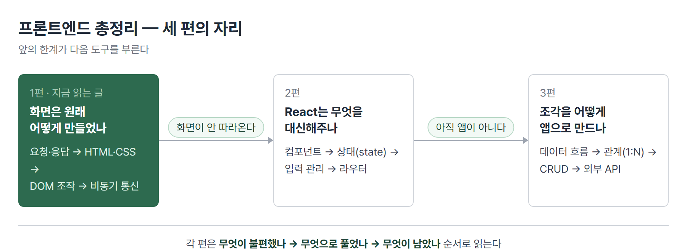

# <LG CNS 6기] 프론트엔드 총정리 (1/3) — 화면을 손으로 그리던 시절

> TL;DR: 캠프 프론트엔드 파트의 앞부분은 **React를 쓰기 전에 React 없이 해보는 구간**이다. 웹이 요청과 응답으로 돈다는 것에서 시작해, 화면을 만들고(HTML·CSS), 움직이고(JavaScript·DOM), 데이터를 받아오는(비동기 통신) 데까지 온다. 그리고 마지막에 벽을 만난다 — **값이 바뀌어도 화면은 그대로다.** 그 벽이 2편의 주제인 React를 부른다.

## 이 시리즈에 대해

LG CNS Inspire Camp의 프론트엔드 파트에서 무엇을 배우는지, **순서와 이유**를 따라 정리한 글이다. 날짜나 몇 일차인지는 쓰지 않는다. 중요한 것은 언제 배웠느냐가 아니라 **앞의 불편이 어떻게 다음 도구를 부르는가**이기 때문이다.

전체는 세 편이다.



각 절은 같은 리듬으로 간다. **무엇이 불편했나 → 무엇으로 풀었나 → 무엇이 남았나.**

프로그래밍을 처음 접하거나 수업을 못 들은 사람도 읽을 수 있게, 용어는 처음 나올 때 풀어 쓴다.

## 1. 웹은 요청과 응답 한 쌍으로 돈다

브라우저 주소창에 주소를 넣고 엔터를 치면 무슨 일이 일어나는가. 브라우저가 그 주소의 서버에 **"이거 주세요"라고 요청**하고, 서버가 **"여기 있습니다"라고 응답**한다. 웹에서 일어나는 거의 모든 일이 이 한 쌍의 반복이다.

응답에는 잘 됐는지 아닌지를 알리는 번호가 붙는다. 흔히 보는 **404**가 그것이다.

| 번호대 | 뜻 |
|---|---|
| 200번대 | 성공 |
| 400번대 | 요청한 쪽 잘못 (주소가 틀림 = 404) |
| 500번대 | 서버 쪽 잘못 |

> 💡 이 번호는 나중에 코드에서 "성공했으니 화면을 바꾸자"를 판단하는 기준이 된다. 지금은 그냥 응답에 성적표가 붙는다고만 알면 된다.

**남은 것**: 그래서 응답으로 정확히 무엇이 오는가?

## 2. 응답에 무엇이 오는가 — 풀 브라우징과 SPA

같은 웹사이트라도 응답으로 받는 것이 두 가지로 갈린다.

| 방식 | 응답으로 받는 것 | 화면 |
|---|---|---|
| **풀 브라우징** | 완성된 페이지 통째로 | 화면 전체가 깜빡이며 새로 그려짐 |
| **SPA** (Single Page Application) | 데이터만 (JSON이라는 형식) | 필요한 부분만 바뀜, 깜빡임 없음 |

주소창만 봐도 구분이 된다. 페이지를 옮길 때마다 주소가 통째로 바뀌고 화면이 깜빡이면 앞쪽, 주소는 바뀌는데 화면 일부만 스르륵 바뀌면 뒤쪽이다.

수업에서 이걸 눈으로 확인하는 실습을 한다. 부트스트랩(미리 만들어진 화면 부품 모음)으로 로그인 화면을 만들고 `form`이라는 HTML 기능으로 제출해 보면, **입력한 비밀번호가 주소창에 그대로 나타난다.**

```
http://.../login?email=win@naver.com&password=123456789
```

주소 뒤에 `?이름=값&이름=값` 형태로 입력값이 붙어 나간 것이다. 이게 풀 브라우징 방식의 기본 동작이다.

> 💡 SPA가 `form` 대신 JavaScript와 JSON으로 가는 이유가 여기서 눈에 보인다. 화면 깜빡임보다 이쪽이 더 큰 문제다.

**남은 것**: 그러면 그 화면 자체는 무엇으로 만드나?

## 3. 화면을 만든다 — HTML과 CSS

웹 화면은 두 가지로 만든다. **HTML**이 무엇이 있는지(제목·문단·버튼·입력칸), **CSS**가 어떻게 보이는지(색·크기·간격·배치)를 맡는다.

CSS에서 가장 먼저 잡아야 할 것이 **박스 모델**이다. 화면의 모든 요소는 사각형 상자이고, 그 상자는 네 겹으로 되어 있다.

| 겹 | 뜻 |
|---|---|
| content | 내용이 들어가는 실제 칸 |
| padding | 내용과 테두리 사이의 안쪽 여백 |
| border | 테두리 |
| margin | 이 상자와 옆 상자 사이의 바깥 여백 |

간격이 마음대로 안 잡히는 대부분의 상황은 이 넷 중 어디를 건드려야 하는지 헷갈려서 생긴다. **안쪽을 벌리려면 padding, 상자끼리 떼려면 margin**이다.

그리고 그 상자를 지목하는 문법이 **선택자**다. `#아이디`는 하나를 콕 집고, `.클래스`는 같은 표시를 단 것들을 한꺼번에 집는다.

화면 폭에 따라 배치를 바꾸는 장치도 여기 있다. **미디어쿼리**는 "화면이 이 정도 폭일 때만 이 스타일을 적용하라"는 조건문이다.

```css
@media screen and (min-width: 768px) and (max-width: 1023px) {
  body { display: flex; justify-content: center; }
}
```

- 폭 구간은 보통 셋으로 나눈다 — 휴대폰(320~767) · 태블릿(768~1023) · 데스크톱(1024~).

- 브라우저 창을 늘렸다 줄였다 하면 스타일이 갈아끼워지는 것이 보인다. 요즘 도구들이 쓰는 `sm:` `md:` `lg:` 같은 표기도 내부적으로는 이 조건문으로 번역된다.

**남은 것**: 만들어진 화면은 가만히 있다. 누르면 반응하게 하려면?

## 4. 화면을 움직인다 — JavaScript와 DOM

여기서 **JavaScript**가 들어온다. 화면을 움직이는 언어다.

브라우저는 화면에 그려진 HTML을 **JavaScript가 만질 수 있는 형태로 바꿔서** 들고 있다. 이것을 **DOM**이라고 부른다. 화면을 조작한다는 말은 실제로는 이 DOM을 조작한다는 뜻이다.

순서는 항상 셋이다. **찾고 → 값을 꺼내거나 넣고 → 누르면 실행되게 연결한다.**

```js
// 1) 화면에서 그 자리를 찾는다
const emailInput = document.querySelector("#email");

// 2) 값을 꺼낸다
const value = emailInput.value;

// 3) 버튼을 누르면 실행되도록 연결한다
document.querySelector("#loginBtn").addEventListener("click", () => {
  console.log(value);
});
```

- 입력칸의 값은 `.value`로 꺼낸다. 입력칸은 내용을 태그 사이에 담지 않고 **상태로 들고 있기** 때문에, 다른 요소처럼 글자로는 꺼내지지 않는다.

- 마지막 줄의 `() => { ... }`는 **화살표 함수**다. "이 버튼을 누르면 이 일을 해라"에서 그 일에 해당한다.

값을 넣는 쪽도 같은 자리다. **`.value`에 값을 대입하는 것이 곧 화면에 그리는 것**이다.

```js
const user = { email: "win@naver.com", password: "123456789" };
document.querySelector("#email").value = user.email;   // 이 줄이 화면을 바꾼다
```

목록을 그릴 때도 마찬가지다. 배열을 돌면서 HTML 조각을 **글자로 이어 붙여** 화면에 꽂는다.

```js
let html = "";
cardAry.forEach((obj) => {
  html += `<div>${obj.heading}</div>`;
});
element.innerHTML = html;
```

**남은 것**: 화면은 움직이게 됐다. 그런데 화면에 넣을 **데이터**는 위 코드에서 손으로 적은 것이다. 진짜 데이터는 서버에 있다.

## 5. 데이터를 받아온다 — 기다림을 다루는 법

서버에 데이터를 요청하면 답이 즉시 오지 않는다. 짧아도 기다림이 생긴다. 그 시간 동안 화면이 멈춰 있으면 안 된다.

그래서 **비동기**라는 방식을 쓴다. 정의는 간단하다.

> 💡 비동기 = 요청을 보내두고, 답을 기다리는 동안 다른 일을 계속하는 것. 답이 오면 그때 처리한다.

그러려면 "아직 안 온 결과"를 담아둘 자리가 필요하다. 그것이 **Promise**다. 결과가 나중에 담길 빈 상자라고 보면 된다. 상자는 세 상태를 가진다 — 기다리는 중 / 성공 / 실패.

실제로 요청을 보내는 도구는 브라우저에 내장된 **fetch**다. 결과를 받는 문법이 두 가지인데, 하는 일은 같다.

```js
// 방식 1 — 이어 붙이기(체이닝)
fetch(url)
  .then((response) => response.json())   // 봉투를 뜯어 내용을 꺼낸다
  .then((data) => console.log(data))     // 꺼낸 내용을 쓴다
  .catch((error) => console.log(error)); // 실패하면 여기로

// 방식 2 — 기다렸다 받기(async/await)
const response = await fetch(url);
const data = await response.json();
```

- `fetch`가 처음 돌려주는 것은 데이터가 아니라 **응답 봉투**다. `.json()`으로 뜯어야 안의 내용이 나온다. `.then`이 두 번인 이유다.

- 나중에는 **axios**라는 도구를 대신 쓴다. 봉투를 자동으로 뜯어주고, 실패 처리도 더 깔끔하다. 순서가 중요한데, 수업은 `fetch`로 손이 가는 과정을 먼저 겪게 한 뒤에 axios를 준다.

여기서 한 가지가 드러난다. 서버에서 목록을 받아 화면에 그린 뒤, **데이터를 하나 지우는 실습**을 하면 이런 일이 생긴다.

> 데이터는 지워졌는데 화면에서는 그대로 남아 있다.

지운 것은 데이터고, 화면은 그 데이터를 보고 **한 번 그려둔 결과**일 뿐이기 때문이다. 다시 그리라고 시키지 않으면 화면은 옛 모습 그대로다.

여기서 한 번 더 갈린다. "다시 그린다"에도 두 가지가 있다.

| 시도 | 결과 |
|---|---|
| 배열에서만 지운다 | 화면 그대로 |
| 서버에서 목록을 다시 받아온다 | **지운 것이 되살아난다** (서버에는 아직 있으니까) |
| 지운 배열로 화면을 다시 그린다 | 성공 |

**데이터를 다시 받아오는 일**과 **화면을 다시 그리는 일**은 서로 다른 작업이다. 둘을 구분하지 못하면 "지웠는데 다시 나타나는" 상황에서 원인을 못 찾는다.

**남은 것**: 화면을 다시 그리는 일을 매번 사람이 챙겨야 한다.

## 6. 여기서 막힌다 — 단방향

1편의 도착점이자 2편의 출발점이다.

지금까지 만든 구조는 데이터에서 화면으로 **한 방향으로만** 흐른다. 값을 화면에 꽂는 순간 연결은 끝난다. 그 뒤에 값이 바뀌어도 화면은 모른다.

```js
user.email = "new@naver.com";   // 값은 바뀌었지만
                                // 화면은 그대로다 — 다시 꽂아야 바뀐다
```

이 반대말이 **반응형 상태(reactive state)** 다. 데이터가 바뀌면 화면이 알아서 따라 바뀌는 구조를 말한다.

정리하면 이 구간에서 손에 남는 불편은 두 가지다.

| 불편 | 구체적으로 |
|---|---|
| 갱신을 사람이 챙긴다 | 값이 바뀔 때마다 "다시 그려라"를 직접 써야 한다. 빠뜨리면 화면만 옛날 값 |
| 화면 조각을 글자로 조립한다 | 목록을 그릴 때 HTML을 문자열로 이어 붙인다. 길어질수록 어디가 틀렸는지 안 보인다 |

**이 둘을 대신해주는 도구가 React다.** 다음 편의 주제다.

## 다음 편

**2편 — React가 대신해주는 것.** 화면을 조각(컴포넌트)으로 나누는 법, 값이 바뀌면 화면이 따라오게 하는 장치(state), 그리고 주소에 따라 화면을 바꾸는 라우터까지.

---

### 이 편이 다루는 원문 TIL

- 2026-07-28 — 웹의 요청·응답 구조와 SPA
- 2026-07-29 — CSS 선택자·박스 모델·풀브라우징 폼
- 2026-07-30 — DOM 조작·이벤트·단방향 렌더링
- 2026-07-31 — Promise·비동기 통신·axios

태그: LG CNS 6기, 개발자, LGCNSINSPIRECAMP
