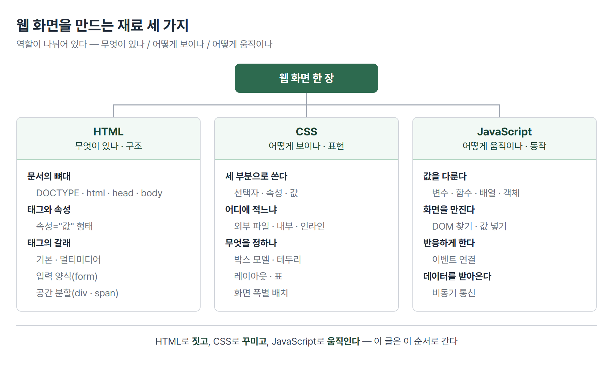

# <LG CNS 6기] 프론트엔드 총정리 (1/3) — 웹 화면은 무엇으로 만들어지는가

> TL;DR: 이 글은 **웹 화면 한 장이 무엇으로 만들어지는지**를 재료 단위로 정리한다. HTML로 짓고, CSS로 꾸미고, JavaScript로 움직이고, 서버와 데이터를 주고받는다 — 이 네 덩어리가 순서대로 나온다. 마지막에 이 방식의 한계를 만나는데, 그 한계가 2편의 React를 부른다.

## 이 시리즈에 대해

LG CNS Inspire Camp 프론트엔드 파트에서 **무엇을 어떤 순서로 배우는지**를 정리한 글이다. 날짜나 몇 일차인지는 쓰지 않는다. 중요한 것은 언제 배웠느냐가 아니라 **앞의 한계가 어떻게 다음 도구를 부르는가**이기 때문이다.


각 편은 같은 리듬으로 간다. **무엇이 불편했나 → 무엇으로 풀었나 → 무엇이 남았나.**

프로그래밍을 처음 접하거나 수업을 못 들은 사람도 읽을 수 있게, 용어는 처음 나올 때 풀어 쓴다.

## 이 편의 지도

먼저 전체 구조를 잡고 들어간다. **웹 화면 한 장은 재료 세 가지로 만들어진다.** 셋은 하는 일이 서로 다르고, 배우는 순서도 이 순서다.



이 글은 위 트리를 왼쪽부터 차례로 훑고, 마지막에 **서버와 데이터를 주고받는 부분**을 얹는다.

| 절 | 다루는 것 | 답하는 질문 |
|---|---|---|
| 1 | HTML | 화면에 무엇이 있는지 어떻게 적나 |
| 2 | CSS | 그것이 어떻게 보일지 어떻게 정하나 |
| 3 | JavaScript | 누르면 반응하게 어떻게 만드나 |
| 4 | 통신 | 서버의 데이터를 어떻게 가져오나 |
| 5 | 한계 | 왜 이것만으로는 부족한가 |

## 1. HTML — 화면에 무엇이 있는지 적는다

### 문서의 뼈대

HTML 문서는 정해진 뼈대가 있다. 모든 웹 페이지가 이 모양에서 시작한다.

```html
<!DOCTYPE html>
<html>
  <head>
    <title>HTML5 시작</title>
  </head>
  <body>
    화면에 보이는 내용은 여기에 적는다.
  </body>
</html>
```

| 부분 | 하는 일 |
|---|---|
| `<!DOCTYPE html>` | 이 문서가 HTML5 규격이라는 선언 |
| `<head>` | **화면에 안 보이는** 정보 — 제목, 문자 인코딩, 외부 파일 연결 |
| `<body>` | **화면에 보이는** 내용 전부 |

> 💡 `head`와 `body`의 구분이 첫 관문이다. CSS 파일이나 외부 라이브러리를 연결하는 자리가 `head`이고, 눈에 보이는 것은 전부 `body`다.

`head`에는 문서를 설명하는 정보(메타정보)도 들어간다. 문자 인코딩(`<meta charset="UTF-8">`)을 빼먹으면 한글이 깨진다.

### 태그와 속성

HTML은 **태그**로 쓴다. 여는 태그와 닫는 태그 사이에 내용을 넣는다.

```html
<태그명 속성="값">내용</태그명>
```

- **속성**은 그 태그의 부가 정보다. 태그 없이 혼자 쓸 수 없고, 항상 `속성="값"` 형태다.
- 예를 들어 ``에서 `src`는 어떤 그림인지, `alt`는 그림이 안 뜰 때 대신 보여줄 글자다.

### 지켜야 할 규칙

수업 자료가 규칙을 따로 다룬다. 안 지켜도 화면이 뜨는 경우가 많아서, 오히려 나중에 원인 찾기 어려운 문제가 된다.

| 규칙 | 안 지키면 |
|---|---|
| 태그는 소문자로 쓴다 | 대소문자를 안 가리지만 섞이면 읽기 어려움 |
| 종료 태그를 반드시 쓴다 | 닫히지 않은 태그가 뒤 내용을 삼킴 |
| 태그를 겹치지 않고 완전히 감싼다 | `<a><b></a></b>` 같은 꼬임 — 표시가 깨짐 |
| 들여쓰기로 포함 관계를 보인다 | 어느 태그 안인지 안 보임 |

**연속된 공백과 줄바꿈은 하나의 공백으로 처리된다.** 스페이스를 열 번 눌러도 한 칸이다. 편집기에서 줄을 아무리 예쁘게 맞춰도 화면에는 반영되지 않는다는 뜻이다. 간격은 CSS로 잡는다.

주석은 `<!-- 이렇게 -->` 쓴다. 화면에 안 나오지만 **소스 보기로는 보인다.**

### 태그의 갈래

태그는 종류가 많지만 갈래로 묶으면 넷이다.

| 갈래 | 예 | 쓰임 |
|---|---|---|
| 기본 태그 | `h1`~`h6`, `p`, `a`, `ul`/`li`, `table` | 제목·문단·링크·목록·표 |
| 멀티미디어 태그 | `img`, `video`, `audio` | 그림·영상·소리 |
| 입력 양식 태그 | `form`, `input`, `button`, `select` | 사용자 입력을 받는 자리 |
| 공간 분할 태그 | `div`, `span` | 의미 없이 **묶기만** 하는 상자 |

마지막 갈래가 중요하다. `div`와 `span`은 그 자체로 아무 의미가 없고, **여러 요소를 한 덩어리로 묶어 CSS를 걸거나 JavaScript로 다루기 위한** 상자다. 실무 화면의 대부분이 `div` 조합이다.

**남은 것**: 뼈대는 세웠는데 전부 검은 글씨에 왼쪽 정렬이다. 보기 좋게 만들려면?

## 2. CSS — 어떻게 보일지 정한다

### 왜 나눠 놨나

HTML이 내용, CSS가 디자인을 맡는다. 나눠 두면 **내용을 안 건드리고 디자인만 바꿀 수 있고**, 여러 페이지가 같은 디자인 파일을 공유할 수 있다.

### 세 부분으로 쓴다

CSS 한 줄은 항상 세 부분이다.

```css
p { color: blue; background-color: yellow; }
```

| 부분 | 위 예시 | 뜻 |
|---|---|---|
| **선택자** | `p` | 어디에 적용할지 |
| **속성** | `color` | 무엇을 바꿀지 |
| **값** | `blue` | 어떻게 바꿀지 |

### 어디에 적느냐 — 세 자리와 우선순위

같은 CSS를 세 군데에 적을 수 있다.

```html
<!-- 1) 외부 파일 : 별도 .css 파일을 연결 -->
<link rel="stylesheet" href="style.css">

<!-- 2) 내부 : head 안에 직접 -->
<style> p { color: blue; } </style>

<!-- 3) 인라인 : 태그에 직접 -->
<p style="color: red;">글자</p>
```

셋이 충돌하면 **더 가까이 붙은 쪽이 이긴다.** 인라인이 가장 세고, 그다음 내부, 외부 파일 순이다.

> 💡 이 순서가 나중에 발목을 잡는다. 인라인으로 박아 둔 스타일은 CSS 파일로는 못 이기고, 강제로 이기려면 `!important`를 쓰게 되는데, 한 번 쓰면 그다음 것도 `!important`를 붙여야 하는 연쇄가 시작된다.

### 선택자 — 대상을 집는 법

가장 많이 쓰는 셋만 알면 시작할 수 있다.

| 선택자 | 뜻 |
|---|---|
| `p` | 그 태그 전부 |
| `#login` | `id="login"`인 요소 **하나** |
| `.card` | `class="card"`인 요소 **전부** |

`id`는 문서에서 유일해야 하고 `class`는 여러 개가 같이 달 수 있다. 그래서 **하나만 콕 집을 때 `id`, 같은 모양을 여럿 만들 때 `class`**를 쓴다.

### 박스 모델 — 간격이 안 맞는 이유

CSS 속성 중 가장 먼저 잡아야 할 것이다. **화면의 모든 요소는 사각형 상자**이고, 그 상자는 네 겹이다.

| 겹 | 위치 |
|---|---|
| content | 내용이 들어가는 실제 칸 |
| padding | 내용과 테두리 **사이**(안쪽 여백) |
| border | 테두리 |
| margin | 이 상자와 옆 상자 **사이**(바깥 여백) |

> 💡 간격이 뜻대로 안 잡히는 상황은 대부분 여기서 갈린다. **안을 벌리려면 padding, 상자끼리 떼려면 margin.**

### 배치와 화면 폭

요소를 나란히 놓거나 가운데 정렬하는 것은 레이아웃 속성이 맡는다. 그리고 **미디어쿼리**는 "화면이 이 정도 폭일 때만 이 스타일을 적용하라"는 조건문이다.

```css
@media screen and (min-width: 768px) and (max-width: 1023px) {
  body { display: flex; justify-content: center; }
}
```

- 폭 구간은 보통 셋으로 나눈다 — 휴대폰(320~767) · 태블릿(768~1023) · 데스크톱(1024~).
- 요즘 도구의 `sm:` `md:` `lg:` 표기도 내부적으로는 이 조건문으로 번역된다.

**남은 것**: 보기 좋아졌지만 여전히 가만히 있다. 버튼을 눌러도 아무 일도 없다.

## 3. JavaScript — 화면을 움직인다

### DOM — 화면을 만질 수 있는 형태

브라우저는 화면에 그려진 HTML을 **JavaScript가 다룰 수 있는 형태로 바꿔서** 들고 있다. 이것을 **DOM**이라 부른다. "화면을 조작한다"는 말은 실제로는 이 DOM을 조작한다는 뜻이다.

순서는 언제나 셋이다.

```js
// 1) 찾는다 — id가 email인 요소
const emailInput = document.querySelector("#email");

// 2) 값을 꺼낸다
const value = emailInput.value;

// 3) 누르면 실행되게 연결한다
document.querySelector("#loginBtn").addEventListener("click", () => {
  console.log(value);
});
```

- 입력칸의 값은 `.value`로 꺼낸다. 입력칸은 내용을 태그 사이에 담지 않고 **상태로 들고 있어서**, 다른 요소처럼 글자로는 꺼내지지 않는다.
- `() => { ... }`는 **화살표 함수**다. "이 버튼을 누르면 할 일"이 이 안에 들어간다.

### 값을 넣는 것이 곧 그리는 것

반대 방향도 같은 자리다.

```js
const user = { email: "win@naver.com" };
document.querySelector("#email").value = user.email;   // 이 줄이 화면을 바꾼다
```

목록을 그릴 때는 배열을 돌며 **HTML을 글자로 이어 붙여** 화면에 꽂는다.

```js
let html = "";
cardAry.forEach((obj) => {
  html += `<div>${obj.heading}</div>`;
});
element.innerHTML = html;
```

- 백틱(`` ` ``)으로 감싼 문자열 안에서는 `${변수}`가 값으로 바뀐다. 작은따옴표로 쓰면 `${obj.heading}`이 **글자 그대로** 화면에 나온다.

**남은 것**: 화면은 움직이게 됐다. 그런데 화면에 넣을 데이터는 위 코드에서 **손으로 적은 것**이다. 진짜 데이터는 서버에 있다.

## 4. 서버와 데이터를 주고받는다

### 요청과 응답 한 쌍

주소창에 주소를 넣고 엔터를 치면, 브라우저가 그 서버에 **요청**하고 서버가 **응답**한다. 웹에서 일어나는 거의 모든 일이 이 한 쌍의 반복이다.

응답에는 성적표 같은 번호가 붙는다.

| 번호대 | 뜻 |
|---|---|
| 200번대 | 성공 |
| 400번대 | 요청한 쪽 잘못 (주소가 틀림 = 404) |
| 500번대 | 서버 쪽 잘못 |

### 응답으로 무엇이 오는가 — 두 갈래

같은 웹사이트라도 응답으로 받는 것이 갈린다. 이 차이가 화면 구조 전체를 가른다.

| 방식 | 응답으로 받는 것 | 화면 |
|---|---|---|
| **풀 브라우징** | 완성된 페이지 통째로 | 전체가 깜빡이며 새로 그려짐 |
| **SPA** (Single Page Application) | 데이터만 (JSON 형식) | 필요한 부분만 바뀜 |

HTML의 `form` 태그로 로그인 정보를 제출해 보면 풀 브라우징의 기본 동작이 눈에 보인다. **입력한 비밀번호가 주소창에 그대로 나타난다.**

```
http://.../login?email=win@naver.com&password=123456789
```

주소 뒤에 `?이름=값&이름=값` 형태로 붙어 나간 것이다.

> 💡 SPA가 `form` 대신 JavaScript와 JSON으로 가는 이유가 여기서 보인다. 깜빡임보다 이쪽이 더 큰 문제다.

### 기다림을 다루는 법 — 비동기

서버에 요청하면 답이 즉시 오지 않는다. 그동안 화면이 멈춰 있으면 안 되므로 **비동기** 방식을 쓴다.

> 💡 비동기 = 요청을 보내두고, 답을 기다리는 동안 다른 일을 계속하는 것.

"아직 안 온 결과"를 담아둘 자리가 **Promise**다. 결과가 나중에 담길 빈 상자이고, 상태는 셋이다 — 기다리는 중 / 성공 / 실패.

요청 도구는 브라우저에 내장된 **fetch**다.

```js
fetch(url)
  .then((response) => response.json())   // 봉투를 뜯어 내용을 꺼낸다
  .then((data) => console.log(data))     // 꺼낸 내용을 쓴다
  .catch((error) => console.log(error)); // 실패하면 여기로
```

- `fetch`가 처음 돌려주는 것은 데이터가 아니라 **응답 봉투**다. `.json()`으로 뜯어야 내용이 나온다. `.then`이 두 번인 이유다.
- 나중에는 **axios**를 대신 쓴다. 봉투를 자동으로 뜯어주고 실패 처리도 깔끔하다. 수업은 `fetch`로 손이 가는 과정을 먼저 겪게 한 뒤 axios를 준다.

### 지웠는데 화면에 그대로 남는다

서버에서 목록을 받아 화면에 그린 뒤, 데이터를 하나 지우면 이런 일이 생긴다.

| 시도 | 결과 |
|---|---|
| 배열에서만 지운다 | 화면 그대로 |
| 서버에서 목록을 다시 받아온다 | **지운 것이 되살아난다** (서버에는 아직 있으니까) |
| 지운 배열로 화면을 다시 그린다 | 성공 |

**데이터를 다시 받아오는 일**과 **화면을 다시 그리는 일**은 서로 다른 작업이다. 둘을 구분하지 못하면 원인을 못 찾는다.

**남은 것**: 화면을 다시 그리는 일을 매번 사람이 챙겨야 한다.

## 5. 여기서 막힌다 — 단방향

1편의 도착점이자 2편의 출발점이다.

지금까지의 구조는 데이터에서 화면으로 **한 방향으로만** 흐른다. 값을 화면에 꽂는 순간 연결은 끝난다.

```js
user.email = "new@naver.com";   // 값은 바뀌었지만 화면은 그대로다
```

이 반대말이 **반응형 상태(reactive state)** — 데이터가 바뀌면 화면이 알아서 따라 바뀌는 구조다.

이 구간에서 손에 남는 불편은 둘이다.

| 불편 | 구체적으로 |
|---|---|
| 갱신을 사람이 챙긴다 | 값이 바뀔 때마다 "다시 그려라"를 직접 써야 한다. 빠뜨리면 화면만 옛날 값 |
| 화면 조각을 글자로 조립한다 | 목록을 그릴 때 HTML을 문자열로 이어 붙인다. 길어질수록 어디가 틀렸는지 안 보인다 |

**이 둘을 대신해주는 도구가 React다.** 다음 편의 주제다.

## 다음 편

**2편 — React가 대신해주는 것.** 화면을 조각(컴포넌트)으로 나누는 법, 값이 바뀌면 화면이 따라오게 하는 장치(state), 주소에 따라 화면을 바꾸는 라우터까지.

---

### 이 편이 다루는 원문 TIL

- 2026-07-28 — 웹의 요청·응답 구조와 SPA
- 2026-07-29 — CSS 선택자·박스 모델·풀브라우징 폼
- 2026-07-30 — DOM 조작·이벤트·단방향 렌더링
- 2026-07-31 — Promise·비동기 통신·axios

태그: LG CNS 6기, 개발자, LGCNSINSPIRECAMP
