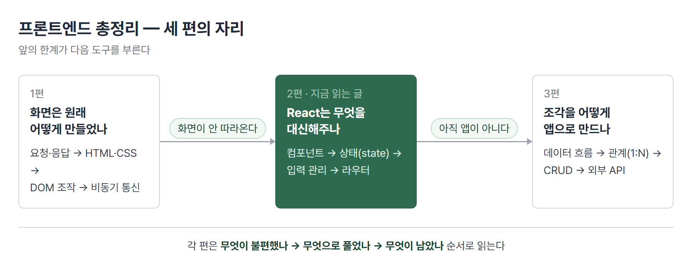
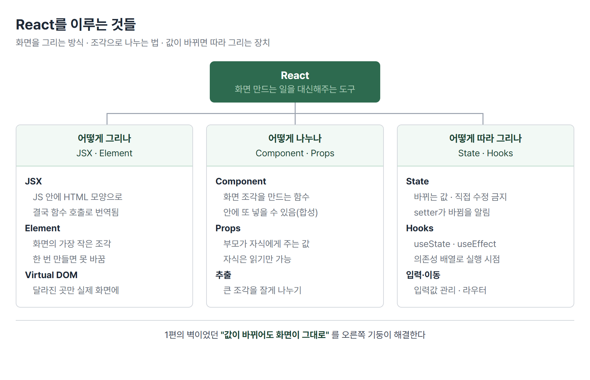

# <LG CNS 6기] 프론트엔드 총정리 (2/3) — React는 무엇을 대신해주는가

> TL;DR: 1편에서 만난 벽은 **값이 바뀌어도 화면이 그대로**라는 것이었다. React는 그 갱신을 대신해준다. 이 글은 React가 화면을 그리는 방식(JSX·Element), 화면을 조각으로 나누는 법(Component·Props), 그리고 값이 바뀌면 따라 그리게 하는 장치(State·Hooks)를 순서대로 정리한다.

## 이 시리즈에 대해

LG CNS Inspire Camp 프론트엔드 파트에서 **무엇을 어떤 순서로 배우는지**를 정리한 글이다. 날짜나 몇 일차인지는 쓰지 않는다. 중요한 것은 언제 배웠느냐가 아니라 **앞의 한계가 어떻게 다음 도구를 부르는가**이기 때문이다.



1편을 안 읽었어도 이 글만으로 읽힌다. 다만 **왜 React가 필요한가**는 1편에서 겪은 불편이 근거다. 한 문장으로 옮기면 이렇다.

> 데이터에서 화면으로 한 방향으로만 흐른다. 값을 화면에 꽂는 순간 연결이 끝나서, 그 뒤에 값이 바뀌어도 화면은 모른다. **다시 그려라를 사람이 매번 써야 한다.**

## 이 편의 지도

React를 이루는 것들은 세 기둥으로 묶인다. 이 글은 왼쪽부터 차례로 간다.



| 절 | 다루는 것 | 답하는 질문 |
|---|---|---|
| 1 | React라는 도구 | 무엇이고 왜 빠른가 |
| 2 | JSX | JavaScript 안에 HTML을 어떻게 쓰나 |
| 3 | Element | 화면의 가장 작은 조각은 무엇인가 |
| 4 | Component · Props | 화면을 어떻게 나누고 값을 어떻게 내려주나 |
| 5 | State | 바뀌는 값은 어떻게 다루나 |
| 6 | Hooks | 언제 실행할지를 어떻게 정하나 |
| 7 | 입력과 이동 | 입력칸과 화면 전환은 어떻게 다루나 |
| 8 | 남은 한계 | 왜 아직 앱이 아닌가 |

## 1. React라는 도구

### 라이브러리다, 프레임워크가 아니다

**라이브러리**는 자주 쓰는 기능을 정리해 모아 놓은 것이다. 문자열 다루는 기능, 날짜 다루는 기능처럼 필요한 것만 꺼내 쓴다.

React는 그중에서도 **UI 라이브러리**다. UI(User Interface)는 사용자가 보고 만지는 화면을 말한다. 같은 자리에 Angular, Vue.js가 있다.

| | 라이브러리 | 프레임워크 |
|---|---|---|
| 주도권 | **내가** 필요할 때 부른다 | **틀이** 내 코드를 부른다 |
| 자유도 | 높다 — 나머지는 내가 고른다 | 낮다 — 정해진 방식을 따른다 |
| 예 | React | Angular |

> 💡 React는 화면 그리는 일만 맡는다. 주소 이동이나 통신 같은 나머지는 별도 도구를 골라 붙인다. 자유롭지만 **고를 것이 많다**는 뜻이기도 하다.

### 왜 빠른가 — Virtual DOM

1편에서 화면을 바꾸려면 DOM을 직접 만졌다. 그런데 DOM 조작은 비싸다. 하나 바꿀 때마다 브라우저가 다시 계산하고 다시 그린다.

React는 **실제 화면을 바로 건드리지 않는다.** 대신 화면의 사본을 메모리에 들고 있다가, 값이 바뀌면 사본끼리 비교해서 **달라진 곳만** 실제 화면에 반영한다. 이 사본을 **Virtual DOM**이라 부른다.

```
값 변경  →  새 사본 만들기  →  이전 사본과 비교  →  달라진 곳만 실제 화면에
```

**남은 것**: 그러면 그 화면 조각은 무엇으로 쓰나?

## 2. JSX — JavaScript 안에 HTML 모양으로 쓴다

React에서 화면은 이렇게 생겼다.

```jsx
const element = <h1>Hello, world!</h1>;
```

JavaScript 파일 안에 HTML 태그가 그대로 들어와 있다. 이것을 **JSX**라 부른다 — JavaScript의 문법 확장이다.

브라우저는 JSX를 모른다. 그래서 실행 전에 **평범한 함수 호출로 번역**된다.

```jsx
// 내가 쓰는 것
const element = <h1 className="greeting">Hello, world!</h1>;

// 실제로 번역되는 것
const element = React.createElement("h1", { className: "greeting" }, "Hello, world!");
```

- 두 코드는 **완전히 같다.** JSX는 아래를 보기 좋게 쓰기 위한 표기법이다.
- 그래서 JSX 안에서 `class` 대신 `className`을 쓴다. 결국 JavaScript 객체의 속성 이름이 되는데, `class`는 JavaScript의 예약어라 쓸 수 없기 때문이다.

JSX를 쓰는 이유는 둘이다.

| 이유 | 내용 |
|---|---|
| 가독성 | 화면 모양이 코드에 그대로 보인다. 함수 호출로 쓰면 중첩될수록 못 읽는다 |
| 보안 | 값에 태그가 섞여 들어와도 **글자로 처리**한다. 남이 넣은 코드가 실행되는 공격을 막는다 |

JSX 안에서 값을 넣을 때는 중괄호를 쓴다.

```jsx
const name = "홍길동";
const element = <div>Hello, {name}</div>;
```

**남은 것**: 이렇게 만든 것의 정체는 무엇인가?

## 3. Element — 화면의 가장 작은 조각

JSX가 번역되어 만들어지는 것이 **Element**다. 수업 자료의 표현으로는 *React 앱을 이루는 가장 작은 building block*이다.

중요한 것은 Element가 **화면 그 자체가 아니라 JavaScript 객체**라는 점이다.

```js
// <button className="bg-green">확인</button> 이 만들어내는 것
{
  type: "button",
  props: { className: "bg-green", children: "확인" }
}
```

- 화면에 무엇이 있어야 하는지를 **적어 놓은 설명서**에 가깝다. 이 설명서를 보고 React가 실제 화면을 그린다.

### 한 번 만든 Element는 바꿀 수 없다

Element의 가장 큰 특징이다. 만들고 나면 그 안의 내용이나 속성을 **바꿀 수 없다**(immutable).

그러면 화면은 어떻게 바뀌는가. **바꾸는 게 아니라 새로 만든다.** 새 Element를 만들어 다시 그리게 하고, React가 이전 것과 비교해 달라진 부분만 실제 화면에 반영한다.

> 💡 "바꾼다"가 아니라 "새로 만들고 비교한다" — 이 발상이 React 전체를 관통한다. Props도, State도 같은 규칙을 따른다.

**남은 것**: 화면 하나를 통째로 Element로 쓰면 너무 크다. 나누려면?

## 4. Component와 Props — 조각으로 나누고 값을 내려준다

### Component는 화면 조각을 만드는 함수

수업 자료는 레고 블록에 비유한다. 완성품을 한 덩어리로 찍지 않고, 작은 블록을 만들어 끼워 맞춘다.

**Component**는 그 블록을 만드는 함수다. 값을 받아서 Element를 돌려준다.

```jsx
function Welcome(props) {
  return <h1>안녕, {props.name}</h1>;
}
```

- 일반 함수가 `입력 → 출력`이라면, Component는 `입력 → React Element`다.
- 컴포넌트 안에 다른 컴포넌트를 넣을 수 있다. 이것을 **합성**이라 한다.

```jsx
function App() {
  return (
    <div>
      <Welcome name="Mike" />
      <Welcome name="Steve" />
      <Welcome name="Jane" />
    </div>
  );
}
```

- 같은 블록을 값만 바꿔 세 번 썼다. **재사용**이 컴포넌트의 존재 이유다.
- 컴포넌트 이름은 **대문자로 시작**해야 한다. 소문자면 React가 HTML 태그로 본다.

### Props는 부모가 내려주는 값, 그리고 읽기 전용

위에서 넘긴 `name="Mike"`가 **Props**다. 부모가 자식에게 내려보내는 값이고, JavaScript 객체 형태로 전달된다.

핵심 규칙이 하나 있다. **자식은 받은 Props를 바꿀 수 없다.**

수업 자료의 비유가 정확하다.

> **붕어빵이 다 구워졌는데, 속재료를 바꿀 수는 없다.**

바꾸고 싶으면 **새 값을 넘겨 새로 만든다.** 3절의 Element 규칙과 같은 이야기다.

이것을 원칙으로 표현하면 이렇다 — *모든 React 컴포넌트는 자신의 Props에 대해 순수 함수처럼 행동해야 한다.* 순수 함수란 **입력을 건드리지 않고, 같은 입력에 항상 같은 결과를 주는** 함수다.

```js
function sum(a, b) { return a + b; }        // 순수 — 입력을 안 건드림
function withdraw(account, amount) {         // 순수하지 않음 — 입력을 바꿈
  account.total -= amount;
}
```

> 💡 이 규칙 덕분에 화면을 예측할 수 있다. 같은 값을 주면 같은 화면이 나오므로, 화면이 이상하면 **넘긴 값을 보면 된다.**

### 큰 컴포넌트는 잘게 나눈다 — 추출

댓글 한 줄처럼 보이는 화면도 안을 뜯으면 프로필 사진, 작성자 정보, 본문, 날짜가 들어 있다. 이걸 한 함수에 다 쓰면 길어지고 재사용도 안 된다.

수업에서는 댓글 컴포넌트를 두 단계로 쪼갠다.

```
Comment
 └ UserInfo        ← 작성자 영역을 떼어냄
    └ Avatar       ← 그 안의 사진만 다시 떼어냄
```

- 떼어낸 `Avatar`는 프로필 사진이 필요한 **다른 화면에서도 그대로** 쓸 수 있다.
- **재사용 가능한 컴포넌트를 많이 가질수록 개발 속도가 빨라진다** — 자료가 강조하는 지점이다.

**남은 것**: 조각은 나눴는데, 아직 전부 **고정된 값**이다. 사용자가 버튼을 눌러 바뀌는 값은?

## 5. State — 바뀌는 값

**State**는 컴포넌트가 들고 있는 **변경 가능한 데이터**다. Props가 부모에게서 받은 값이라면, State는 그 컴포넌트 자신의 값이다.

| | Props | State |
|---|---|---|
| 누가 주나 | 부모가 내려줌 | 컴포넌트 자신이 가짐 |
| 바꿀 수 있나 | 못 바꿈(읽기 전용) | 바꿀 수 있음 — 단 **정해진 방법으로만** |
| 예 | 표시할 이름 | 버튼을 눌러 켜고 끈 상태 |

규칙 두 가지가 따라온다.

1. **개발자가 정한다.** 화면에 그려지거나 데이터 흐름에 쓰이는 값만 State로 둔다. 아무 값이나 넣으면 불필요하게 다시 그려진다.
2. **직접 수정하면 안 된다.** 값을 바꿔도 React는 모른다. 반드시 정해진 함수로 바꿔야 한다.

이 "정해진 함수"가 **setter**다. 함수형 컴포넌트에서는 `useState`가 값과 setter를 한 쌍으로 만들어 준다.

```jsx
const [count, setCount] = useState(0);
//     ^값     ^바꾸는 함수     ^처음 값

setCount(count + 1);   // 값 변경 + "바뀌었다"고 React에 알림
count = count + 1;     // 이렇게 하면 화면이 안 바뀐다
```

> 💡 setter는 값을 바꾸는 일과 **바뀌었다고 신고하는 일**을 함께 한다. 1편에서 사람이 손으로 하던 "다시 그려라"가 이 신고로 대체된다.

**남은 것**: 값은 관리되는데, "화면이 처음 뜰 때 데이터를 받아오는" 같은 일은 언제 하나?

## 6. Hooks — 함수형 컴포넌트가 상태를 다루게 해준 것

### 왜 생겼나

React 컴포넌트는 두 가지 방식으로 쓸 수 있었다.

| | Function Component | Class Component |
|---|---|---|
| 생김새 | 함수 | 클래스 |
| 예전엔 | **State를 못 씀** | State를 씀 |
| 생명주기 | 못 다룸 | 메서드로 다룸 |

여기서 **생명주기(Lifecycle)** 는 컴포넌트가 화면에 나타났다가 사라지기까지의 일생이다. 화면에 처음 붙고(Mounting) → 값이 바뀌며 갱신되고(Updating) → 화면에서 떨어진다(Unmounting).

함수형은 짧고 읽기 쉬운데 State를 못 써서 반쪽이었다. 그래서 **React 16.8에서 Hooks가 나왔다** — 함수형 컴포넌트에서도 상태와 생명주기를 다루게 해주는 장치다. 지금은 대부분 함수형으로 쓴다.

### useEffect — 화면을 그린 다음에 할 일

**Side effect**는 그 컴포넌트 바깥에 영향을 주거나, 그리는 도중에는 끝낼 수 없는 일을 말한다. 서버에서 데이터 받아오기가 대표적이다.

```jsx
useEffect(이펙트_함수, 의존성_배열);
```

두 번째 인자에 따라 **언제 실행되는지**가 달라진다. 이 셋이 핵심이다.

| 두 번째 인자 | 실행 시점 |
|---|---|
| 아예 안 씀 | 다시 그릴 때마다 **매번** |
| `[]` (빈 배열) | 화면에 처음 붙을 때 **한 번만** |
| `[값]` | 그 값이 바뀔 때마다 |

```jsx
useEffect(() => {
  loadData();      // 서버에서 목록 받아오기
}, []);            // 처음 한 번만
```

> 💡 의존성 배열을 빠뜨리면 데이터를 받아올 때마다 화면이 다시 그려지고, 그러면 또 받아오는 무한 반복에 빠진다. 빈 배열을 넣는 이유가 이것이다.

### 그 밖의 Hooks

수업 자료가 함께 다루는 것들이다. 이름과 쓰임만 잡아 두면 된다.

| Hook | 하는 일 |
|---|---|
| `useMemo` | 계산 결과를 기억해 뒀다가, 재료가 그대로면 다시 계산하지 않는다 |
| `useCallback` | 같은 개념인데 **값이 아니라 함수**를 기억한다 |
| `useRef` | 다시 그려도 유지되는 상자. 값이 바뀌어도 화면을 다시 그리지 않는다 |

`useMemo`가 기억해 두는 것을 **memoization**이라 부른다. 다만 기억하는 데도 비용이 들기 때문에 **무거운 계산일 때만** 쓴다.

**남은 것**: 값과 실행 시점은 다뤘다. 사용자가 직접 입력하는 값과, 화면 사이 이동은?

## 7. 입력과 이동

### 입력칸의 값을 State가 쥔다

1편에서는 입력값을 `.value`로 꺼내 왔다. React에서는 반대로 간다. **입력칸에 보이는 값 자체를 State가 쥐고**, 사용자가 타이핑하면 State를 바꾸고, 바뀐 State가 다시 입력칸에 그려진다.

```jsx
const [email, setEmail] = useState("");

<input value={email} onChange={(e) => setEmail(e.target.value)} />
```

- 이런 입력칸을 **controlled component**(제어 컴포넌트)라 부른다.
- 화면에 보이는 값과 코드가 아는 값이 **항상 같다.** 1편에서는 둘이 어긋날 수 있었다.

### 주소에 따라 화면을 고른다 — 라우터

SPA는 페이지를 새로 받아오지 않는다. 그러면 주소가 바뀔 때 무엇을 할까. **주소마다 어떤 컴포넌트를 보여줄지 대응표를 만들어 둔다.** 그 일을 하는 도구가 라우터다.

```
/blogs/index      → 목록 화면
/blogs/read/:id   → 상세 화면
```

- `:id` 자리는 **값이 들어오는 칸**이다. `/blogs/read/7`이면 7이 들어온다.
- 화면 안에서 코드로 이동시킬 수도 있다. 저장 버튼을 누르면 목록으로 돌려보내는 식이다.

### 조건에 따라 다른 것을 그린다

로그인 여부처럼 상황에 따라 화면을 갈라야 할 때가 있다. JSX 안에서 조건을 직접 쓴다.

```jsx
{user && <p>{user}님 환영합니다.</p>}        // 있을 때만 그린다
{isLogin ? <LogoutButton /> : <LoginButton />}  // 둘 중 하나
```

> 💡 `&&` 앞에 숫자를 두면 조심해야 한다. `{list.length && <목록 />}`은 목록이 비었을 때 **화면에 0이 찍힌다.** `false`나 `null`은 안 그려지는데 `0`은 글자로 그려지기 때문이다.

**남은 것**: 조각도, 값도, 이동도 갖췄다. 그런데 아직 **하나의 앱**은 아니다.

## 8. 여기서 막힌다 — 조각은 있는데 앱이 아니다

2편의 도착점이자 3편의 출발점이다.

지금까지 배운 것은 전부 **부품**이다. 화면 조각을 만들고, 값을 내려주고, 상태를 바꾸고, 주소에 따라 화면을 골랐다. 하지만 실제 서비스는 이 부품들이 서로 얽혀 돌아간다.

| 남은 질문 | 3편에서 |
|---|---|
| 여러 화면과 파일 사이로 데이터가 어떻게 흐르나 | 미니 블로그를 조립하며 확인 |
| 글 하나에 댓글 여럿 같은 **관계**는 어떻게 다루나 | 1:N 데이터 |
| 만들기·읽기·수정·삭제를 어떻게 다 채우나 | CRUD 한 바퀴 |
| 내가 만들지 않은 서버의 데이터는 어떻게 붙이나 | 외부 API |

## 다음 편

**3편 — 조각을 앱으로, 그리고 남의 데이터까지.** 미니 블로그를 만들며 파일 사이 데이터 흐름을 따라가고, 댓글 관계와 CRUD를 채운 뒤, 외부 API를 붙이는 데까지 간다.

---

### 이 편이 다루는 원문 TIL

- 2026-08-03 — 스켈레톤 UI·모듈·React 시작(JSX·props)
- 2026-08-04 — TypeScript·axios·useState/useEffect
- 2026-08-05 — controlled component·라우터·조건부 렌더링

수업 자료는 `리액트 소개 / JSX / Rendering Elements / Components and Props / State and Lifecycle / Hooks` 순서를 따랐고, 이 글의 절 구성도 그 순서를 기준으로 잡았다.

태그: LG CNS 6기, 개발자, LGCNSINSPIRECAMP
