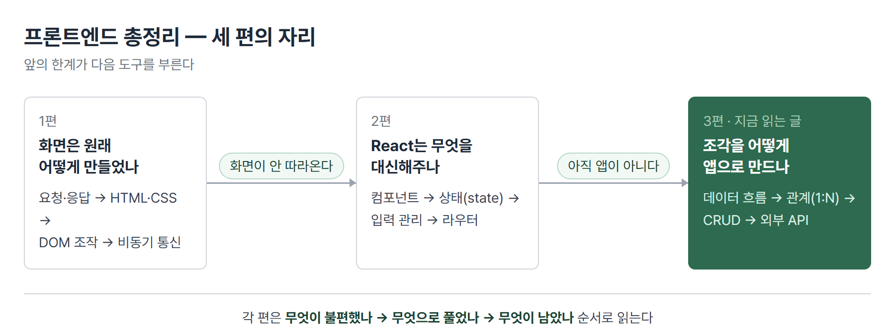
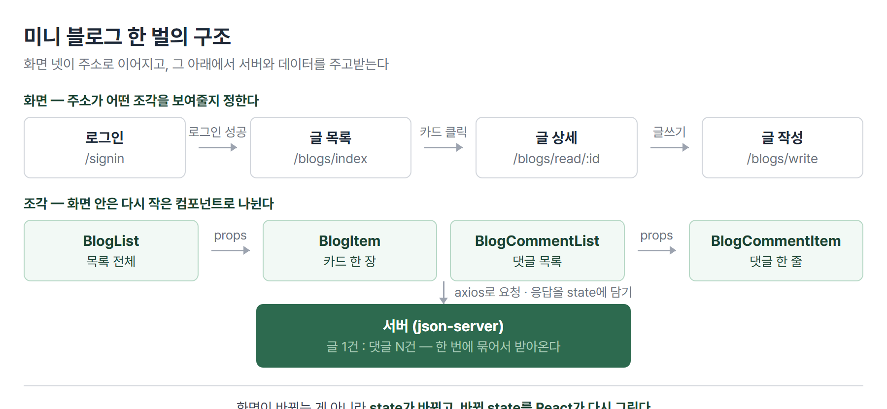

# <LG CNS 6기] 프론트엔드 총정리 (3/3) — 조각을 앱으로, 그리고 남의 데이터까지

> TL;DR: 2편까지는 부품이었다. 이 글은 그 부품으로 **미니 블로그 한 벌**을 조립한다. 화면 넷을 주소로 잇고, 목록을 그리고, 입력을 받고, 글과 댓글의 관계를 다루고, 만들기·읽기·수정·삭제를 채운 뒤, 마지막에 내가 만들지 않은 서버(날씨·지도)의 데이터까지 붙인다.

## 이 시리즈에 대해

LG CNS Inspire Camp 프론트엔드 파트에서 **무엇을 어떤 순서로 배우는지**를 정리한 글이다. 날짜나 몇 일차인지는 쓰지 않는다. 중요한 것은 언제 배웠느냐가 아니라 **앞의 한계가 어떻게 다음 도구를 부르는가**이기 때문이다.



앞 두 편을 안 읽었어도 읽힌다. 다만 여기까지 온 길을 한 줄로 옮기면 이렇다.

> 손으로 화면을 그리다가(1편) 갱신을 React에 맡겼고(2편), 이제 그 조각들이 **서로 얽혀 하나의 앱**이 된다.

## 이 편의 지도

만드는 것은 **글을 쓰고 읽고 댓글을 다는 미니 블로그**다. 화면 넷이 주소로 이어지고, 각 화면은 다시 작은 조각으로 나뉘며, 그 아래에서 서버와 데이터를 주고받는다.



| 절 | 다루는 것 | 답하는 질문 |
|---|---|---|
| 1 | 앱의 구조 | 파일과 화면이 어떻게 얽히나 |
| 2 | 목록 그리기 | 배열을 화면으로 어떻게 바꾸나 |
| 3 | 입력 관리 | 입력칸이 여러 개면 어떻게 하나 |
| 4 | 조각 조합 | 컴포넌트를 어떻게 합치나 |
| 5 | 관계 | 글 하나에 댓글 여럿을 어떻게 다루나 |
| 6 | CRUD | 만들고 읽고 고치고 지우기 |
| 7 | 외부 API | 남의 서버 데이터를 어떻게 붙이나 |
| 8 | 여기까지 | 무엇이 남았나 |

## 1. 앱의 구조 — 데이터가 어디서 어디로 흐르나

완성 화면보다 먼저 잡아야 할 것은 **데이터가 어디에 담기고 어디로 내려가는가**다.

규칙은 하나다. **데이터는 화면(page)이 쥐고, 아래 조각들은 받아서 그리기만 한다.**

```
BlogReadPage          ← 서버에서 글·댓글을 받아 state로 쥔다
 └ BlogCommentList     ← 댓글 배열을 props로 받는다
    └ BlogCommentItem  ← 댓글 한 건을 props로 받는다
```

- 서버에 요청하고 state를 바꾸는 일은 **위(page)에서만** 한다.
- 아래 조각은 받은 값을 그리고, 버튼이 눌리면 **위에서 내려준 함수를 부른다.** 스스로 서버를 부르지 않는다.

> 💡 이 규칙을 지키면 "지금 이 값이 어디서 왔나"를 위로 따라 올라가며 찾을 수 있다. 아무 데서나 서버를 부르면 그 추적이 불가능해진다.

**남은 것**: 받아온 배열을 화면에 어떻게 펼치나?

## 2. 목록 그리기 — `map`과 `key`

배열을 화면 조각의 배열로 바꾸는 것이 `map`이다.

```jsx
<Wrapper>
  {blogs.map((blog) => (
    <BlogItem key={blog.id} blog={blog} />
  ))}
</Wrapper>
```

- `map`은 배열의 각 항목을 다른 것으로 바꿔 **새 배열**을 만든다. 여기서는 글 한 건을 카드 한 장으로 바꿨다.
- 원본 배열은 그대로다. 2편에서 본 "바꾸지 않고 새로 만든다"가 여기서도 지켜진다.

### `key`는 왜 필수인가

목록을 그릴 때 각 항목에 `key`를 줘야 한다. 안 주면 콘솔에 경고가 뜬다.

`key`는 **같은 목록 안에서 각 줄을 구분하는 고유한 값**이다. React가 목록을 다시 그릴 때, 어느 줄이 그대로고 어느 줄이 새것인지 판단하는 근거로 쓴다.

| `key`로 쓰는 값 | 언제 |
|---|---|
| `blog.id` 같은 **고유 번호** | 기본. 데이터에 id가 있으면 항상 이쪽 |
| 순번(`index`) | 고유한 값이 정말 없을 때만 |

> 💡 순번을 쓰면 중간 항목이 지워질 때 번호가 밀린다. 각 줄이 자기 상태(예: 수정 중인지)를 갖고 있으면, **그 상태가 엉뚱한 줄에 옮겨 붙는다.** 겉보기엔 멀쩡해서 원인을 찾기 어렵다.

참고로 `key`는 **같은 목록 안에서만** 겹치지 않으면 된다. 다른 목록과 값이 같아도 상관없다.

**남은 것**: 글을 쓰려면 입력을 받아야 한다. 입력칸이 여러 개면?

## 3. 입력 관리 — 여러 칸을 하나로 묶는다

2편에서 입력칸 하나를 state가 쥐는 방식(controlled component)을 봤다. 그런데 글 작성 화면에는 제목·내용·카테고리처럼 칸이 여럿이다. 칸마다 state와 핸들러를 만들면 코드가 배로 늘어난다.

그래서 **객체 하나로 묶고 핸들러도 하나만 둔다.**

```jsx
const [form, setForm] = useState({ title: "", content: "" });

const changeHandler = (e) => {
  const { name, value } = e.target;
  setForm({ ...form, [name]: value });
};

<input name="title" value={form.title} onChange={changeHandler} />
<input name="content" value={form.content} onChange={changeHandler} />
```

- `[name]`은 **변수 값을 키 이름으로 쓰겠다**는 뜻이다. `name="title"`인 칸에서 이벤트가 오면 `title` 항목만 바뀐다.
- `{ ...form, ... }`은 기존 값을 모두 복사한 뒤 바뀐 항목만 덮어쓴다. 나머지 칸의 값이 날아가지 않게 하는 부분이다.

> 💡 칸이 늘어도 **고칠 곳이 늘지 않는다.** 입력칸에 `name`만 정확히 달면 된다.

**남은 것**: 화면이 커진다. 컴포넌트를 어떻게 합치나?

## 4. 조각 조합 — 합성과 `children`

컴포넌트를 조합하는 방법은 두 갈래로 정리된다.

| 방식 | 뜻 |
|---|---|
| **합성**(Composition) | 여러 컴포넌트를 **합쳐서** 새 컴포넌트를 만든다 |
| 상속(Inheritance) | 다른 컴포넌트를 물려받아 만든다 |

React는 **합성으로 간다.** 상속은 쓰지 않는다.

합성 중에서도 자주 쓰는 형태가 **담기(Containment)** 다. 사이드바나 대화상자처럼 **안에 무엇이 들어올지 미리 알 수 없는** 상자를 만들 때 쓴다.

```jsx
function FancyBorder(props) {
  return <div className="FancyBorder">{props.children}</div>;
}

<FancyBorder>
  <h1>어서 오세요</h1>
  <p>우리 사이트에 방문하신 것을 환영합니다!</p>
</FancyBorder>
```

- 여는 태그와 닫는 태그 **사이에 넣은 내용**이 통째로 `props.children`으로 들어온다.
- 테두리 상자는 안에 뭐가 오든 상관하지 않는다. 그래서 어디서든 재사용된다.

### 큰 컴포넌트는 쪼갠다

댓글 한 줄도 안을 뜯으면 사진·작성자·본문·날짜다. 한 함수에 다 쓰면 길어지고 재사용도 안 되므로 잘게 나눈다.

```
Comment
 └ UserInfo
    └ Avatar
```

**재사용 가능한 조각을 많이 가질수록 다음 화면을 만드는 속도가 빨라진다.**

**남은 것**: 글과 댓글은 별개 데이터인데 서로 붙어 있다. 이런 관계는?

## 5. 관계 — 글 하나에 댓글 여럿

글 1건에 댓글이 여러 건 달린다. 이런 관계를 **1:N(일대다)** 이라 부른다.

데이터는 서버에서 따로 관리된다. 댓글에는 자기가 어느 글에 달렸는지를 가리키는 값(`blogId`)이 들어 있다.

```json
{ "id": 1, "title": "첫 글" }
{ "id": 7, "blogId": 1, "comment": "잘 봤습니다" }
```

화면에서는 글과 댓글이 함께 필요하다. 두 번 요청하는 대신 **한 번에 묶어서 달라고** 요청할 수 있다.

```js
await api.get(`/blogs/${blogId}?_embed=comments`);
// 응답: { id, title, content, comments: [ ... ] }
```

- `_embed`는 연습용 서버(json-server)가 제공하는 조건이다. "이 글에 딸린 댓글도 같이 담아 달라"는 뜻이다.
- 받은 뒤에는 글과 댓글을 **각각 다른 state에 나눠 담는다.** 댓글만 바뀔 때 글까지 다시 그리지 않기 위해서다.

> 💡 저장할 때 주의할 점이 하나 있다. 주소에서 꺼낸 값은 **문자열**이다. `blogId`를 그대로 넣으면 서버에 `"1"`과 `1`이 섞여 저장되고, 나중에 조회가 어긋난다.

**남은 것**: 이제 읽는 것은 된다. 쓰고 고치고 지우는 것은?

## 6. CRUD 한 바퀴

서버와 주고받는 기본 동작 넷을 묶어 **CRUD**라 부른다.

| 동작 | 요청 방식 | 성공 응답 |
|---|---|---|
| 만들기 (Create) | `POST` | 201 |
| 읽기 (Read) | `GET` | 200 |
| 수정 (Update) | `PATCH` (일부) / `PUT` (통째로) | 200 |
| 삭제 (Delete) | `DELETE` | 200 · 204 |

- **`PATCH`와 `PUT`의 차이**: 댓글 본문 한 줄만 고칠 때 나머지를 다 보낼 이유가 없다. 그래서 `PATCH`를 쓴다.
- 성공 판정은 **한 숫자로 딱 찍기보다 2xx 묶음으로** 보는 편이 안전하다. 서버가 바뀌면 삭제 성공 코드가 200에서 204로 달라질 수 있는데, 그러면 **삭제는 되는데 화면만 안 바뀐다.**

### 화면은 필요한 부분만 다시 그린다

댓글 한 건을 추가했다고 목록 전체를 다시 받아올 필요는 없다. 서버가 성공을 알려주면 **손에 있는 배열만 갱신**한다.

```jsx
setComments((ary) => [...ary, response.data]);                       // 추가
setComments((ary) => ary.filter((c) => c.id !== id));                // 삭제
setComments((ary) => ary.map((c) => (c.id === id ? { ...c, comment: mention } : c)));  // 수정
```

세 줄 모두 **원본을 건드리지 않고 새 배열을 만든다.** 2편의 규칙이 여기서도 그대로다.

### setter에 값 대신 함수를 넘기는 이유

위 코드에서 `setComments(ary => ...)` 형태를 쓴 데는 이유가 있다.

```jsx
setComments([...comments, response.data]);      // 위험
setComments((ary) => [...ary, response.data]);  // 안전
```

`comments`를 직접 쓰면 **그 함수가 만들어진 시점의 배열**을 잡는다. 서버 응답을 기다리는 사이에 배열이 바뀌었다면, 낡은 배열 위에 얹게 되어 그사이의 변경이 사라진다.

> 💡 값을 직접 쓰면 "내가 기억하는 값", 함수를 넘기면 "React가 알려주는 지금 값".

**남은 것**: 여기까지는 전부 내 서버다. 남의 서버는?

## 7. 외부 API — 내가 만들지 않은 서버

날씨(OpenWeather)와 지도(카카오맵)를 붙인다. 내 서버와 다른 점은 셋이다.

| | 내 서버 | 남의 서버 |
|---|---|---|
| 응답 모양 | 내가 정함 | **상대가 정함** — 큰 뭉치에서 필요한 것만 꺼냄 |
| 신분 확인 | 없음 | **API 키**를 실어 보냄 |
| 실패 처리 | 통신 실패로 잡힘 | **통신은 성공인데 내용이 실패**일 수 있음 |

### 요청과 응답 읽기

```js
const endPoint = `https://api.openweathermap.org/data/2.5/weather?lat=${lat}&lon=${lon}&appid=${key}`;
await fetch(endPoint)
  .then((response) => response.json())
  .then((data) => setWeather(data));
```

- 응답 뭉치는 크다. 그중 필요한 것만 꺼내 쓴다. 온도는 기본 단위가 **켈빈**이라 그대로 쓰면 300 같은 숫자가 나온다 — 섭씨 = K − 273.15.
- **요청이 실패해도 `fetch`는 성공으로 친다.** 서버가 "그런 도시 없음"이라고 답한 것도 통신 자체는 성공이라 `.catch`로 안 잡힌다. 응답 안의 상태값을 따로 봐야 한다.

### 열쇠를 어디에 두나

키를 두는 자리가 서비스마다 다르다.

| 서비스 | 자리 |
|---|---|
| 날씨 | `.env` 파일 → 코드에서 `process.env.REACT_APP_...`으로 읽음 |
| 지도 | `index.html`의 스크립트 주소에 직접 |

지도는 브라우저가 스크립트를 내려받아 실행하는 방식이라 키가 주소에 실려야 한다. 그런데 여기서 불편한 사실이 나온다.

> 💡 **`.env`에 넣은 키도 결국 브라우저까지 간다.** 빌드되어 브라우저에서 실행되므로 개발자 도구를 열면 보인다. `.env`가 막는 것은 **소스 저장소에 올라가는 것**이지 사용자에게 감추는 것이 아니다.

그래서 방어는 감추기가 아니라 **제한**이다. 콘솔에서 사용할 도메인을 등록해 두고 등록되지 않은 곳에서 부르면 거부되게 한다. 정말 감춰야 하는 키는 애초에 프론트엔드에 두지 않고 서버를 한 겹 세운다.

## 8. 여기까지 온 길

세 편을 한 문장으로 이으면 이렇다.

> **화면을 손으로 그리다가**(1편) → **갱신을 React에 맡기고**(2편) → **조각을 앱으로 조립해 남의 데이터까지 붙였다**(3편).

### 아직 안 잡힌 것

정직하게 적으면 배운 것보다 남은 것이 많다. 같은 자리에서 막히는 사람이 있을 테니 그대로 남긴다.

| 남은 것 | 어디까지 왔나 |
|---|---|
| `useEffect` 정리(cleanup) 함수 | 의존성 배열까지만. 화면에서 떠날 때 정리하는 부분은 미학습 |
| 사용자 정의 Hook | 이름만 들음 |
| JWT의 실제 흐름 | 인증과 인가의 구분까지. 발행·검증은 백엔드 몫 |
| CORS의 preflight 조건 | 브라우저가 막고 서버가 허락한다까지. 어떤 요청이 사전 확인을 부르는지는 미확인 |
| `class` → `className` 손버릇 | 개념은 알지만 **손이 계속 `class`로 간다.** 아는 것과 몸에 붙은 것은 다르다 |

### 수업 자료에는 더 있다

교재를 끝까지 넘겨 보면 뒤에 두 가지가 더 있다. 수업 진도로는 다루지 않은 부분이다.

- **Context** — props를 부모에서 자식으로 한 칸씩 내려보내다 보면 깊어질수록 번거로워진다. 여러 컴포넌트가 함께 봐야 하는 값을 공용 창고에 두는 방식이다.
- **Redux** — 같은 문제를 더 큰 규모에서 다루는 별도 도구다.

지금 단계에서 이름과 **왜 필요한지**만 알아 두면 된다. props를 내려보내는 게 불편해지는 순간이 오면 그때 찾게 된다.

---

### 이 편이 다루는 원문 TIL

- 2026-08-06 — 미니 블로그 MVP·데이터 흐름·form 통합 관리
- 2026-08-07 — 컴포넌트 합성·1:N 댓글·useMemo
- 2026-08-10 — 댓글 수정(PATCH)·외부 API·API 키 보관

수업 자료의 `Lists and Keys / Form / Composition vs Inheritance` 구성을 절 구성의 기준으로 삼았다.

태그: LG CNS 6기, 개발자, LGCNSINSPIRECAMP
