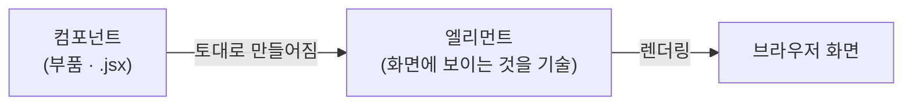
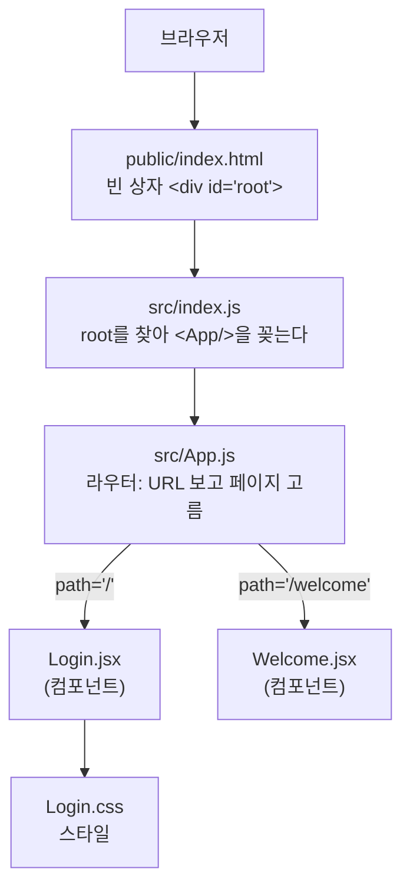

# 리액트 기초 정리 — 정체·환경·구조·연결, 그리고 다음에 볼 것

> 목적: 사전학습 리액트 파트를 한 장으로 잡는다.
> 세세한 문법보다 **전체 흐름**이 목적이다. 예시는 내 `react_pjt`(로그인 실습) 그대로.
> 헷갈릴 때 여기부터 보고, 더 팔 지점은 맨 아래 목록에서 고른다.

---

## 0. 리액트가 뭔가 (1강)

- **프론트엔드를 만드는 라이브러리**다. 프레임워크가 아니다 — 기준은 **제어권의 주체**. 라이브러리는 제어권이 **내 코드**에 있고(내가 불러다 쓴다), 프레임워크는 틀이 흐름을 쥐고 내 코드가 끼워진다. 리액트는 앞쪽.
- **SPA**(Single Page Application) 기반이다. HTML은 한 장뿐이고, 화면 전환은 브라우저가 페이지를 새로 불러오는 게 아니라 리액트가 내용물을 갈아끼운다.
- **컴포넌트 기반**이다. 부품(컴포넌트)을 조립해 웹을 만든다.

**컴포넌트 → 엘리먼트 → 렌더링** 순서로 화면이 나온다.



- 컴포넌트는 설계도(부품), 엘리먼트는 그걸로 만들어 화면에 뜬 것. `<Login />`이 엘리먼트다.
- 컴포넌트를 쓰는 큰 이유는 **재사용성**이고, 재사용성의 조건은 **독립적인 모듈**이다. 다른 모듈에 의존하면 그걸 다 들고 가야 해서 재사용이 안 된다(자바의 "결합은 낮게"와 같은 이야기).
- `.jsx` 파일 하나 = 컴포넌트 하나. 클래스 기반도 있지만 **추세는 함수 기반**.

---

## 1. 환경 — 프로젝트가 만들어지기까지 (2강)

컴포넌트를 짜려면 먼저 돌릴 판이 필요하다. 흐름은 이렇다.

```
Node.js 설치 → npx create-react-app 프로젝트명 → 폴더 생성 → npm start → localhost:3000
```

| 도구        | 역할                                                                                        |
| ----------- | ------------------------------------------------------------------------------------------- |
| **Node.js** | 리액트 프로젝트를 돌리는 기반(런타임)                                                       |
| **npm**     | 패키지**설치·관리** (다운로드·버전·의존성). `npm install axios`                             |
| **npx**     | 패키지**실행**. 전역 설치 없이 일회성으로 받아 돌림. `npx create-react-app`                 |
| **CRA**     | 리액트 골격 생성 도구. 단**deprecated**(더 이상 권장 안 됨) — 강의는 CRA로 가지만 알아둘 것 |

- `npm start`는 **개발 서버**를 띄운다. 그 터미널은 서버가 점유하므로 명령을 더 치려면 창을 하나 더 연다. 코드 저장하면 자동 새로고침.
- Windows에서 PowerShell로 npm이 막히면 **실행 정책**(ExecutionPolicy) 문제다. git bash는 그 우회.

---

## 2. 한눈에 — 화면이 뜨기까지의 사슬

브라우저가 리액트 화면을 그리는 순서는 **한 줄기 사슬**이다. 위에서 아래로 부른다.



**핵심 문장 하나**: `index.html`(빈 상자) ← `index.js`(상자에 App을 꽂음) ← `App.js`(URL 보고 페이지 선택) ← `페이지 컴포넌트`(실제 화면) ← `CSS`(꾸밈).

---

## 3. 파일·폴더 지도 (누가 무슨 역할)

| 위치                       | 역할                 | 한 줄                                                                    |
| -------------------------- | -------------------- | ------------------------------------------------------------------------ |
| `public/index.html`        | **화면의 빈 상자**   | `<div id="root">` 하나뿐. 리액트가 여기에 그린다. SPA라 HTML은 이 한 장  |
| `src/index.js`             | **진입점(시작)**     | `root`를 찾아 `<App />`을 꽂는다. 앱이 시작되는 지점                     |
| `src/App.js`               | **교통정리(라우터)** | URL을 보고 어떤 페이지 컴포넌트를 보여줄지 고른다                        |
| `src/component/page/*.jsx` | **페이지 컴포넌트**  | 실제 화면 조각.`Login.jsx`, `Welcome.jsx`                                |
| `src/component/css/*.css`  | **스타일**           | 컴포넌트를 꾸민다.`.jsx`에서 import해서 붙임                             |
| `package.json`             | **명세서**           | 설치된 라이브러리(axios·react-router-dom…)와 실행 명령(`npm start`) 목록 |
| `node_modules/`            | **라이브러리 창고**  | 설치한 패키지 실물. 직접 안 건드림                                       |

> 폴더 이름(`component/page`, `component/css`)은 **내가 정한 정리 방식**이지 리액트 규칙이 아니다. `src` 안이면 어디든 되지만, 역할별로 나눠두면 찾기 쉽다.

---

## 4. 연결의 사슬 — 코드로 따라가기

### ① `public/index.html` — 빈 상자

```html
<div id="root"></div>
```

화면엔 이 빈 `div` 하나만 있다. 나머지는 전부 리액트가 JS로 채운다.

### ② `src/index.js` — 상자에 App을 꽂는다

```js
const root = ReactDOM.createRoot(document.getElementById("root")); // 빈 상자 찾기
root.render(<App />); // 상자에 App 꽂기
```

`getElementById("root")`로 ①의 빈 상자를 찾아, 거기에 `<App />`을 렌더한다.
**여기서 무엇을 render하느냐가 화면의 뿌리를 정한다.** 라우팅을 쓰려면 반드시 `<App />`을 render해야 한다(App 안에 라우터가 있으니까).

### ③ `src/App.js` — URL 보고 페이지 고르기 (라우터)

```jsx
<Router>
  <Routes>
    <Route path="/" element={<Login />} />
    <Route path="/welcome" element={<Welcome />} />
  </Routes>
</Router>
```

"주소가 `/`면 Login을, `/welcome`이면 Welcome을 보여줘"라는 **규칙표**다. 주소창이 바뀌면 여기서 해당 컴포넌트로 화면을 갈아끼운다.

### ④ 페이지 컴포넌트 — 실제 화면 (`Login.jsx`)

JSX로 화면을 그리고, 상태·이벤트로 동작을 붙인다(5장). `import "../css/Login.css"`로 스타일도 붙인다.

> import 경로의 `.`은 **현재 폴더**, `..`은 **상위 폴더**. `'./App'`=같은 폴더의 App, `'../css/Login.css'`=한 칸 위로 올라가 css 폴더.

---

## 5. 컴포넌트 안쪽 — 4개 부품 (Login.jsx로 보기)

컴포넌트 하나는 보통 이 네 가지로 이뤄진다.

| 부품                 | 정체                                 | Login.jsx 예                                                    |
| -------------------- | ------------------------------------ | --------------------------------------------------------------- |
| **JSX**              | 화면 생김새(HTML처럼 생긴 것)        | `return ( <div>...<button>로그인</button></div> )`              |
| **state (useState)** | 변하는 값. 바뀌면 화면이 다시 그려짐 | `const [userId, setUserId] = useState("")`                      |
| **이벤트 핸들러**    | 사용자 동작에 반응하는 함수          | `const handleSubmit = (e) => {...}` / `onSubmit={handleSubmit}` |
| **props**            | 부모가 자식에게 넘겨주는 값(속성)    | (아직 안 씀. 컴포넌트 간 값 전달 때 등장)                       |

**제어 컴포넌트 패턴**(입력창): 값을 state에 묶는다.

```jsx
<input value={userId} onChange={(e) => setUserId(e.target.value)} />
```

타이핑 → `setUserId` 호출 → state 변경 → 화면 갱신. **state가 화면의 단일 원천**이다.

**JSX에서 지켜야 하는 것들** (HTML과 다른 지점):

| 규칙                        | 내용                                                           |
| --------------------------- | -------------------------------------------------------------- |
| `{}` = JS 삽입              | JSX 안에서 JS를 쓰는 표시.`{error}`, `{username}`              |
| 조건부 렌더                 | `{error && <p>{error}</p>}` — error가 있을 때만 그린다         |
| `className`                 | `class` 대신 씀                                                |
| 인라인 스타일은 camelCase   | `margin-top` → `marginTop`. 소문자로 쓰면 그냥 무시됨          |
| 대문자 시작 = 컴포넌트      | 리액트는 대문자로 시작하는 태그를 컴포넌트로 본다(`<Login />`) |
| `export default` / `import` | 내보내야 다른 파일이 가져다 쓸 수 있다                         |

---

## 6. 스타일 — CSS 붙이기 (4강)

- `.jsx`에서 `import "../css/Login.css"`로 불러온다. **import한 CSS는 전역**이다 — 그 컴포넌트에만 갇히지 않는다.
- **클래스 선택자**는 `.login-box { ... }`처럼 앞에 `.`을 붙이고, JSX의 `className="login-box"`와 짝이 된다.
- **태그 선택자**는 그냥 쓴다. `body { ... }`는 컴포넌트가 아니라 **문서의 `<body>`**(public/index.html에 늘 있음)를 겨냥한다 — 컴포넌트에 body 태그가 없어도 먹는다.
- `background-color`는 **단색만** 받는다. 그라디언트는 이미지라 `background`(또는 `background-image`)로 줘야 한다. 타입이 안 맞으면 그 줄만 조용히 버려진다.

---

## 7. 라우팅 — URL로 화면 갈아끼우기 (react-router-dom, 5강)

SPA는 HTML이 한 장이라, 브라우저가 페이지를 새로 안 불러온다. 그래서 **URL별 화면 전환을 대신 해줄 라이브러리**가 `react-router-dom`이다.

| 조각                    | 역할                                                        |
| ----------------------- | ----------------------------------------------------------- |
| `BrowserRouter`(Router) | 라우팅 기능을 켜는 껍데기. 전체를 감쌈                      |
| `Routes`                | 규칙표 묶음                                                 |
| `Route`                 | 규칙 한 줄.`path`(주소) + `element`(보여줄 컴포넌트)        |
| `useNavigate()`         | 코드로 페이지 이동시키는 함수 (예: 로그인 성공 →`/welcome`) |
| `useLocation()`         | 지금 주소·같이 넘어온 값(`location.state`)을 읽는 훅        |

이동 방법 두 갈래: **`useNavigate`**(리액트식, 화면만 갈아끼움·빠름) vs **`window.location.href`**(주소 자체를 바꿔 페이지 새로고침). 라우터를 쓰면 보통 앞쪽.

---

## 8. 통신 — 서버와 데이터 주고받기 (axios, 5강)

`axios`는 **백엔드에 요청을 보내고 응답을 받는** 도구다.

```jsx
const res = await axios.post("http://localhost:8080/api/login", {
  userId,
  password,
});
const token = res.data.token; // 서버가 준 토큰
localStorage.setItem("token", token); // 브라우저에 저장해 로그인 상태 유지
```

- **비동기**: 요청 보내고 응답이 언제 올지 모른 채 다음 줄로 넘어간다.
- **`async/await`**: `await`가 그 함수를 **응답 올 때까지 멈춰** 결과를 받게 한다. (동기로 바꾸는 게 아니라, 기다렸다 읽게 순서를 잡아주는 것)
- **토큰**: 로그인 성공 증표. 저장해두면 다음 요청에 붙여 "나 로그인한 사람"임을 증명.
- 실습에선 백엔드가 없어 API 호출은 **주석 처리**하고, 입력 검증(`if (!userId || !password) return`) + `alert`로 흐름만 확인했다.

---

## 9. 막혔을 때 이렇게 봤다 (실습에서 잡은 진단 습관)

실제로 막힌 세 번이 전부 같은 방식으로 풀렸다.

1. **콘솔 에러부터 읽는다.** 버튼이 안 눌리던 원인은 콘솔이 이미 가리키고 있었다 — `The tag <from> is unrecognized`. 증상(로그 안 뜸)만 쫓았으면 핸들러 로직을 의심했을 것.
2. **출처를 가른다 — 내 코드냐 환경이냐.** 남은 빨강·노랑 메시지는 파일명(`Login.jsx` vs `index2.js`)·포트(3000 vs 8081)만 봐도 브라우저 확장이 낸 것이었다. 확장을 배제하려면 시크릿 창.
3. **어디까지 되고 어디부터 안 되나 쪼갠다.** CSS가 "안 먹는다"를 통째로 보지 않고 흰 박스(됨)·배경(안 됨)으로 나누니, 전역 문제(가설: body 태그 없음)가 아니라 특정 속성(`background-color`) 문제로 좁혀졌다.

---

## 10. 자주 헷갈리는 것 (내가 실제로 막혔던 것들)

| 헷갈림                                 | 정리                                                                                                                            |
| -------------------------------------- | ------------------------------------------------------------------------------------------------------------------------------- |
| **컴포넌트 vs 엘리먼트**               | 컴포넌트=부품(설계도), 엘리먼트=그걸로 만들어 화면에 뜬 것.`<Login />`이 엘리먼트                                               |
| **라이브러리 vs 프레임워크**           | 제어권의**주체**로 가른다. 내 코드가 쥐면 라이브러리(리액트), 틀이 쥐면 프레임워크                                              |
| **index.js가 뭘 render?**              | 라우팅 쓰려면`<App />`. `<Login />`을 직접 render하면 App의 라우터가 안 돎                                                      |
| **`className` vs `class`**             | JSX에선`class` 대신 **`className`**                                                                                             |
| **CSS `.` 붙임**                       | 클래스 선택자는`.login-box`. 태그 선택자는 `body`처럼 그냥                                                                      |
| **`background` vs `background-color`** | 그라디언트는 이미지 →`background`. `background-color`엔 단색만                                                                  |
| **`<form>` vs `<from>`**               | 오타 주의.`<from>`은 진짜 폼이 아니라 submit이 안 됨                                                                            |
| **React 인라인 스타일**                | camelCase.`margin-top` → `marginTop`                                                                                            |
| **preventDefault vs 버블링**           | `e.preventDefault()`는 **기본 동작**(폼 제출 시 페이지 리로드)을 막는다. 전파(버블링)를 막는 건 `e.stopPropagation()` — 다른 것 |
| **async/await ≠ 동기화**               | 요청은 여전히 비동기.`await`는 그 함수 하나만 기다리게 해 위→아래로 읽히게 할 뿐                                                |
| **`?.`(옵셔널 체이닝)**                | `location.state?.username` — state가 없으면 에러 대신 `undefined`. `\|\| "Guest"`로 기본값                                      |

---

## 11. 다음에 볼 것 — 더 세세하게 팔 지점 · 추후 공부 포인트

**아직 안 써봤다 (강의에 이름만 나옴)**

- **props 실전** — 부모→자식으로 값 넘기기. 용어만 잡았고 코드로 안 써봤다.
- **useEffect·생명주기** — 커리큘럼 제목(State와 생명주기)엔 있었지만 실습까지 못 갔다. useState 다음으로 만나게 될 훅.

**배선이 남아 있다 (실습 이어서 하면 되는 것)**

- 로그인 성공 → `navigate("/welcome", { state: { username } })`로 **username 넘겨서 이동**. Welcome 쪽 받는 코드(`location.state?.username`)는 이미 있다.
- 주석 처리된 `axios.post` 해제 = **실제 백엔드 연동**. 본교육에서 백엔드(Java)를 배우면 이어붙일 지점.
- `userId`의 setter가 아직 `setUsername`이라 이름이 안 맞음 — 정리해두기.

**손에 덜 익었다 (반복이 필요한 것)**

- `useState`·제어 컴포넌트 패턴. adsp-board에서 본 적은 있지만 처음부터 직접 쓴 건 이번이 처음.

**알아만 둔다 (당장은 아님)**

- CRA는 deprecated — 요즘은 Vite 등으로 프로젝트를 만든다. 본교육 도구가 뭔지 확인.
- 토큰을 localStorage에 두는 방식의 보안 이슈 — 실무에선 논점이 있다 정도만.

---

## 12. 한 문장 요약

> 리액트는 **제어권이 내 코드에 있는 라이브러리**로, **빈 상자(index.html)** 에 **index.js**가 **App**을 꽂고, **App(라우터)** 이 URL 보고 **페이지 컴포넌트**를 고르며, 컴포넌트는 **state로 변하고 CSS로 꾸며지고 axios로 서버와 통신**한다.
