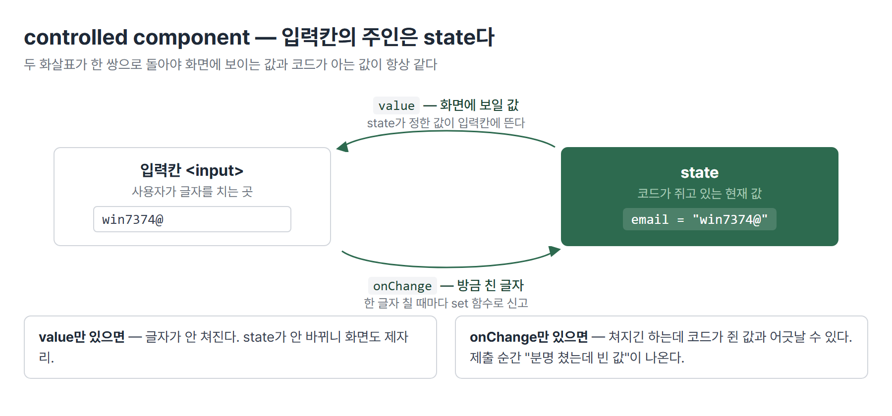
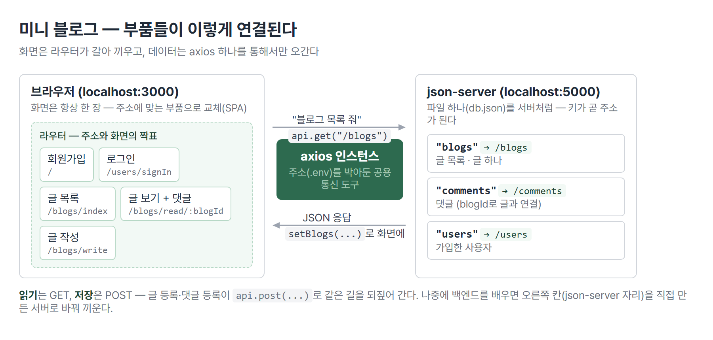
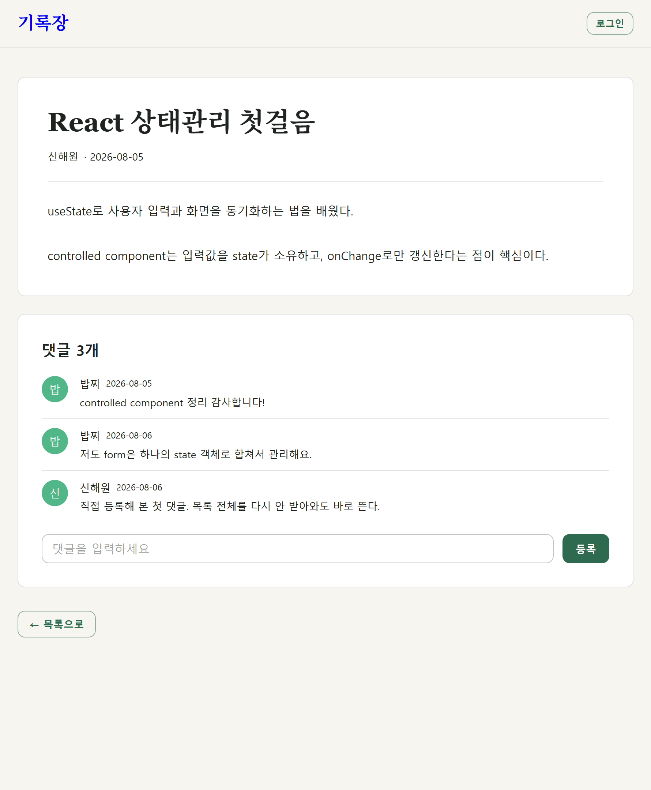

# <LG CNS 6기] 리액트 중간 정리 — 손으로 하던 일이 React로 넘어간 순서

> 블로그를 velog에서 티스토리로 옮기면서 본교육 리액트 파트의 기록이 두 곳에 갈라졌다. 일자별 TIL을 다시 쓰는 대신, 나흘치 내용이 하나의 흐름이었다는 것을 한 장으로 짚어둔다. 처음 보는 사람도 따라올 수 있게, 각 파트를 "무슨 얘기인지 → 그림/화면 → 핵심 코드" 순서로 정리했다.

## 배운 걸 한 문장으로

**"글을 올리고 댓글을 다는 작은 블로그 하나를, 처음부터 끝까지 만들 수 있게 됐다."**

블로그를 하나 상상해 보면 필요한 게 보인다. 글 목록이 뜨는 화면, 글 하나를 읽는 화면, 글을 쓰는 화면. 그리고 글자를 치면 받아주고, 등록을 누르면 저장되고, 저장된 글이 다시 화면에 나타나야 한다. 리액트 수업은 이 재료를 순서대로 하나씩 준 것이었다 — 화면을 만드는 법, 값이 바뀌면 화면이 따라오게 하는 법, 입력을 받고 화면 사이를 오가는 법, 그리고 조립.


| 단계 | 축 | 대표 개념 |
|:----:|-----|-----------|
| ① 부품 | 화면을 부품으로 만든다 | JSX·컴포넌트·props |
| ② 상태 | 값이 바뀌면 화면이 따라온다 | useState·useEffect·axios |
| ③ 입력·이동 | 입력을 받고, 화면을 옮긴다 | controlled component·라우터 |
| ④ 조립 | 조각 전부를 한 앱으로 | 미니 블로그 |

## ✍️ 파트별로 쪼개 보기

### 1. 화면을 부품으로 만든다

리액트 이전에는 화면을 만들 때 글자를 이어 붙였다. "카드 10장을 그려라"라고 하면, 카드 한 장짜리 HTML 문자열을 만들어 10번 이어 붙인 뒤 화면에 통째로 꽂는 식이다. 리액트는 카드 한 장을 **부품**으로 만들어 두고 필요한 만큼 찍어서 조립한다. 이 부품의 이름이 **컴포넌트**다.

> 💡 **화면 = 부품(컴포넌트)의 조립.** 부품에 값을 넣는 통로가 **props**다 — 같은 부품에 다른 값을 넣으면 다른 카드가 나온다.

```jsx
// 이전 방식 — 문자열을 이어 붙여 통째로 꽂는다
container.innerHTML = items.map(renderCard).join("");

// React — 부품을 찍어낸다. 이어 붙이기도, 꽂기도 React가 알아서
{books.map((book) => <Book bookName={book.bookName} />)}
```

- 배열을 도는 `.map()`은 양쪽에 그대로 있다. 바뀐 건 결과물 — 문자열이 아니라 부품.
- 그 덕에 잡일 두 개(`join("")` 이어 붙이기, `innerHTML` 꽂기)가 사라졌다.

### 2. 값이 바뀌면 화면이 따라온다

버튼을 눌러 숫자를 올리는 계수기를 만든다고 하자. 평범한 변수(`let cnt`)에 1을 더하면 값은 올라가는데 **화면은 0에 멈춰 있다.** 리액트가 그 변수를 지켜보고 있지 않아서, 바뀐 줄 모르기 때문이다. 그래서 값을 바꿀 때는 "바뀌었다"고 **알려주는 전용 창구**를 쓴다. 그게 `useState`다.


> 💡 **화면을 바꾸는 유일한 길은 신고다.** `setCnt(...)`처럼 전용 함수로 바꿔야 리액트가 알아차리고 화면을 다시 그린다. 직접 대입(`cnt = cnt + 1`)은 화면에 반영되지 않는다.

서버에서 데이터를 받아올 때도 같은 원리다 — 받아온 목록을 `setBlogs(...)`에 담아야 화면에 뜬다. "언제 받아올 것인가"를 정하는 자리가 `useEffect`다. **화면을 다 그린 뒤에 할 일**을 두는 곳이고, 두 번째 인자를 `[]`로 주면 처음 한 번만 실행된다. 안 주면 그릴 때마다 다시 받아와서 무한 반복에 빠진다.

```jsx
useEffect(() => {
  loadData();   // 목록을 받아와 setBlogs(...)에 담는다
}, []);         // [] = 화면에 처음 붙을 때 한 번만
```

데이터가 오는 길은 이렇게 깔았다. 서버 주소는 코드 밖 파일(`.env`)에 두고, `axios`라는 통신 도구에 그 주소를 박아 앱 전체가 같이 쓴다. 진짜 서버는 아직 없으니 `json-server`라는 도구가 파일 하나(`db.json`)를 서버처럼 흉내 낸다.

### 3. 입력을 받고, 화면을 옮긴다

로그인 화면을 떠올리면 된다. 아이디와 비밀번호를 치고, 버튼을 누르면 서버에 물어보고, 맞으면 다음 화면으로 넘어간다. 여기서 두 가지가 필요하다 — 입력받는 법과 화면을 옮기는 법.

입력칸은 그냥 두면 브라우저가 값을 들고 있다. 리액트에서는 그 값을 **state가 쥐게** 만든다(**controlled component**). 화면에 보이는 값과 코드가 아는 값이 항상 같아지기 때문이다.



> 💡 **입력칸의 주인은 state다.** `value`(state → 화면)와 `onChange`(화면 → state) 한 쌍이 같이 있어야 한다. 하나만 있으면 글자가 안 쳐지거나, 친 값을 코드가 모른다.

이 구조로 만든 회원가입 폼이 이렇게 나온다.


화면 이동은 페이지를 새로 받는 게 아니다. 리액트 앱은 화면이 한 장뿐이고(SPA), 주소에 따라 **부품을 갈아 끼운다.** 주소와 부품을 짝지어 두는 표가 라우터다.

```jsx
<Route path="/users/signIn"       element={<SignInPage />} />
<Route path="/blogs/read/:blogId" element={<BlogReadPage />} />   // :blogId = 자리 표시
```

### 4. 조각을 모아 미니 블로그

마지막은 새 개념 없이 조립이다. 글 목록 보기 / 글 보기 / 댓글 보기 / 글 작성 / 댓글 작성 — 기능 다섯 개를 정하고, 각 기능이 어떤 데이터를 주고받는지 표로 만들고, 그 표대로 화면을 붙였다. 부품들이 연결된 전체 그림은 이렇다.



> 💡 **설계의 순서는 기능 → 데이터 → 화면.** 화면부터 그리면 데이터가 화면 모양에 끌려다닌다. 기능 목록이 먼저 있으면 그것이 곧 API 표가 되고, 화면은 마지막에 붙는다.

구현하면 이런 화면이 된다.



조립하면서 정리된 것 두 가지.

```jsx
// 입력칸이 3개면 state도 3개? — 아니다. 객체 하나로 묶는다
const [form, setForm] = useState({ name: "", email: "", pswd: "" });
const changeHandler = (e) => {
  const { name, value } = e.target;
  setForm({ ...form, [name]: value });   // 어느 칸인지는 name이 말해 준다
};
```

- 입력칸마다 state를 따로 만들면 칸이 늘 때마다 고칠 곳이 서너 군데씩 늘어난다. 객체 하나 + 공용 핸들러 하나면 input에 `name`만 붙이면 된다 — **고칠 곳의 개수를 줄여 실수를 줄인다.**
- 댓글을 등록한 뒤에는 목록 전체를 서버에서 다시 받아올 수도 있고, 방금 쓴 댓글 한 건만 화면에 붙일 수도 있다. 위 캡처의 세 번째 댓글이 후자다. 어느 쪽이 정답이 아니라 서버 왕복(비용)과 최신성(남이 쓴 글) 사이의 선택이다.

## 아직 안 닫힌 것

남아 있는 구멍만 추린다. 다음 진도나 복습에서 닫을 자리.

- `useEffect`의 **cleanup** — 화면에서 떠날 때 뒷정리하는 부분
- **사용자 정의 Hook** — 그냥 함수로 빼는 것과 뭐가 다른지
- **JWT** — 로그인 뒤 받아 두는 출입증. 이름과 자리까지만 배웠고, 만드는 쪽은 백엔드에서
- `class` → `className` **손버릇** — 머리는 아는데 남의 HTML을 붙여 넣는 순간마다 재발

## 다음

프론트엔드 파트가 끝나면 백엔드로 넘어간다. 지금 `json-server`가 대신해 주던 자리 — 요청을 받아 데이터를 꺼내 주는 쪽 — 를 직접 만들게 되고, 수업 중 이름만 스친 ORM(JPA·MyBatis)·DTO를 거기서 다시 만난다.

---
태그: `LG CNS 6기` · `개발자` · `LGCNSINSPIRECAMP`
