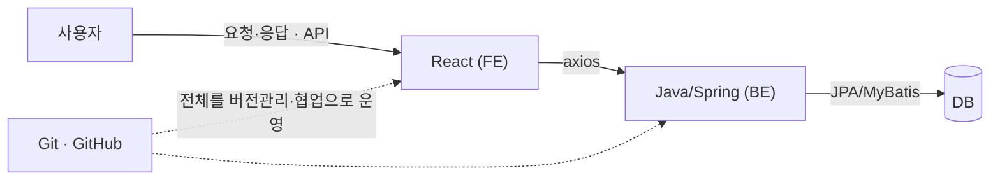
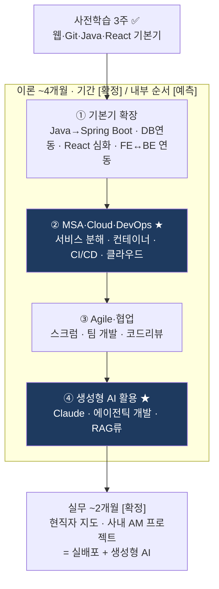

# 사전학습 총정리 & 본교육 로드맵

> - 목적: 사전학습 3주(웹·Git·Java·React)에서 배운 것 정리 + 본교육 진행 방향 예측·대비.
> - 세부 문법·트러블슈팅 = TIL 13건 및 [`react-정리.md`](react-정리.md). 본 문서 = 전체 구조와 진행 방향.
> - 무게중심: ① MSA·Cloud·DevOps(AM) ② 생성형 AI(Claude).
> - 표기 규칙 — **[확정]**: 커리큘럼·캠프전략 노트로 확인 / **[예측]**: 근거 기반 추론 / **[추정]**: 업계 표준 가정(불확실).

---

## 1. 사전학습에서 배운 것

### 1-0. 전체 구조

- 4과목 = 웹 서비스 하나가 도는 데 필요한 부품을 순서대로 학습한 것.
- 총 25강 = 웹 6강 · Git 8강 · Java 6강 · React 5강.

| Step | 과목(강수) | 핵심 | 일차 |
|------|-----------|------|------|
| 1 | 웹 서비스(6) | 요청·응답 구조, FE·BE·DB, API | 1~3일차 |
| 2 | Git(8) | 로컬 버전관리 + 원격 협업 | 4~7일차 |
| 3 | Java(6) | OOP, 레이어 구조, BE 언어 기초 | 8~10일차 |
| 4 | React(5) | 컴포넌트·SPA, 라우팅·통신 | 11~13일차 |

### 1-1. Step 1 — 웹 서비스 (6강)

| 항목 | 내용 |
|------|------|
| 구성 | FE·BE·DB. FE = UI로 사용자와 상호작용하는 유일한 층, request/response로 구동 |
| 진로 갈래 | FE · BE · DB · DevOps(개발+운영) |
| 서버 분리 | WS(정적 리소스) vs WAS(동적 리소스). WS가 요청 받아 정적 리소스 반환 또는 WAS로 전달 |
| DB 계층 | JDBC(WAS↔DB 규약) → ORM(JPA=객체중심 · MyBatis=SQL중심) → DBMS(RDBMS · NoSQL) |
| API | FE·BE 간 통신 규칙. CRUD ↔ HTTP 메서드(GET·POST·PUT·PATCH·DELETE). DB 층 = DML(INSERT·SELECT…) |
| 요청/응답 | 요청 = header(메타·인증토큰) + body(JSON). HTTP vs HTTPS(암호화). 응답 = 상태코드(200·201…) + header |
| FE 스택 | HTML(뼈대) · CSS(디자인) · JS(로직). 반응형 = media query · Bootstrap |
| SPA | HTML 1장, 이동 시 필요한 데이터만 받아 부분 갱신. 초기 로딩 느림 · 이후 빠름 |
| 라이브러리 vs 프레임워크 | 제어권 주체로 구분. 내 코드가 흐름 쥠 → 라이브러리(React) / 틀이 쥠 → 프레임워크 |
| 개발환경 | IDE(이클립스·VS Code), Live Server(로컬 확인). HTML 태그·속성·중첩·대소문자, CSS 선택자 |

### 1-2. Step 2 — Git (8강)

| 항목 | 내용 |
|------|------|
| git vs GitHub | git = 로컬 버전관리(VCS·분산형) / GitHub = 원격 호스트(공유). git 없이 GitHub는 무의미 |
| 조작 방식 | CLI(명령어) / GUI(Sourcetree, 이력 그래프 시각화) |
| 로컬 흐름 | `init` → `add`(staging) → `commit` → `log`/`status`. 커밋에는 **add한 것만** 포함(메시지는 라벨) |
| 파일 상태 | untracked / staged / committed / modified |
| 과거 이동 | `reset`(이력 제거·위험) vs `revert`(취소 커밋 추가·안전). 기준 = 커밋 해시 |
| branch | 생성(`branch`)·이동(`switch`)·삭제(`-d`). 커밋은 현재 브랜치에만 → 이력 분기. `master`/`main` = 이름 차이(기능 동일) |
| 병합 | merge(병합 커밋·갈래 보존) vs rebase(옮겨 심기·일렬·해시 변경). fast-forward = 일직선이면 포인터만 전진 |
| rebase 금지 | push해 공유한 브랜치(해시 변경 → 남과 갈라짐) |
| 충돌(conflict) | 같은 파일·위치를 다른 브랜치서 수정 시 발생. 해결 = 마커 제거 → `add` → commit / `--continue`. 중단 = `--abort`. add는 해결 여부 미검사 |
| 원격 | `push`/`pull`, **pull 먼저 push 나중**, `clone`으로 사본 복제 후 협업 |
| 기존 경험 연결 | 두 기기 동기화 충돌 = 갈라짐, 워크스페이스 규칙 `pull --rebase` = 그 해법 |

### 1-3. Step 3 — Java (6강)

| 항목 | 내용 |
|------|------|
| 성격 | OOP(객체지향). 4요소 = OOP · class · variable · method |
| class vs instance | class = 설계도 / instance = `new`로 찍어낸 실물. 변수·메소드는 instance 소유 |
| 실행 구조 | JDK ⊃ JRE ⊃ JVM. OS 독립 · JVM 의존. `javac`(.java → .class 바이트코드) → `java`(JVM 실행) |
| 설치·규칙 | Adoptium(OpenJDK) 17버전, `JAVA_HOME` 등록. 대소문자 구분, class명 = 파일명, `main` = 진입점 |
| 변수·타입 | 변수 = 데이터 그릇. 기본타입 8개(값: `byte`·`short`·`int`·`long`·`float`·`double`·`char`·`boolean`) vs 참조타입(주소: String 포함 나머지). 정수 기본 `int` · 실수 기본 `double` |
| 메소드 | `[접근지정자][반환타입][이름(매개변수)]{}`. 4유형 = 매개변수 유무 × 반환 유무. 반환 없으면 `void` |
| 객체 생성 | `new 클래스명()` → 참조타입 변수에 할당 → `.`으로 변수·메소드 접근 |
| 프로젝트 구조 | 패키지(폴더)·임포트. 논리 레이어 = Controller → Service → Repository. DTO·Entity·VO. 응집↑ · 결합↓ |
| Spring(MVC) | 이름 수준 소개. JPA(Entity 짝)·MyBatis(DTO 짝) 대응은 미정착 |
| 기존 경험 연결 | ABAP OOP와 비교. 전역/지역변수 = ABAP 프로그램 단위 vs Java 클래스 단위 |

### 1-4. Step 4 — React (5강) — 세부 = [`react-정리.md`](react-정리.md)

| 항목 | 내용 |
|------|------|
| 정체 | FE 라이브러리(제어권 = 내 코드). SPA · 컴포넌트 기반 |
| 화면 흐름 | 컴포넌트(.jsx 부품) → 엘리먼트(화면 기술) → 렌더링(브라우저 표시) |
| 재사용성 | 독립적 모듈(의존 있으면 재사용 불가). Java 결합↓와 동일 |
| 환경 | Node.js(런타임) · npm(설치·관리) · npx(일회성 실행) · CRA(골격, deprecated) |
| 구조 | public/index.html(빈 상자 `
`) · src/index.js(진입점) · App.js(라우터) |
| 상태 | `useState`(값·setter), 제어 컴포넌트(입력값을 상태에 묶음 → 상태 = 화면의 단일 원천) |
| 스타일 | 클래스 선택자(`.`), `className`, `background` vs `background-color`(그라디언트 = 이미지 → background) |
| 라우팅·통신 | react-router-dom(URL별 화면 전환) / axios(비동기·async/await), 토큰(localStorage 저장) |
| 미완 상태 | 백엔드 부재로 `axios.post` 주석 처리 → BE 학습 후 연동할 지점 |

### 1-5. 과목 무관하게 남은 것 — 문제해결 습관

- 콘솔 에러부터 읽기 (예: `<from>` 오타 → 콘솔이 위치 지목).
- 출처 가르기 (내 코드 오류 vs 브라우저 확장 — 파일명·포트로 판별).
- 범위 쪼개기 (통째로 보지 않고 "어디까지 되고 어디부터 안 되나" → CSS 속성 문제로 좁힘).
- AI 활용 순서 = 직접 먼저 → AI로 검증·반박 → 직접 판단.
- 언어·도구가 바뀌어도 이 습관은 유지됨.

---

## 2. 앞으로 어떻게 진행되나

### 2-1. 본교육 구조 [확정]

- 기간: 약 6개월 (2026-07-24 ~ 2027-01 경).
- 이론 ~4개월: MSA · DevOps · Agile · AI 활용.
- 실무 ~2개월: 현직자 지도 하 실제 사내 AM 프로젝트.
- 형태: 하이브리드(메타버스 온라인 + 오프라인).
- 커리큘럼 순서: 웹 → Git → Java → React → **MSA/Cloud/DevOps → AI 프로젝트**. 사전학습 = 앞부분.

### 2-2. 로드맵 예측

- ★ 두 칸(②·④) = 지정한 무게중심(3장).
- 이론 4개월 내부 순서 = 커리큘럼 흐름(부품 → 조립 → 운영 → AI)에서 미룬 **[예측]**. 구간 길이·경계는 미확정.
- 후반 실무 2개월 = 캠프의 차별점 **[확정]**. 타 부트캠프의 "신규 서비스 개발"과 달리 "운영·현대화"(AM) 중심.
- 최종 산출물 **[예측]**: 1기 최종 프로젝트 = GPT-4o·RAG·LangChain 풀스택 실배포(캠프전략 근거). 6기는 Claude 도입 직후라 생성형 AI 비중이 클 가능성.

### 2-3. 사전학습 → 본교육 다리

| 사전학습에서 배운 것 | 본교육에서 만날 것 | 현재 상태 |
|---------------------|-------------------|-----------|
| WS/WAS 분리, API, SPA | MSA(서비스 경계로 분해), API 게이트웨이 [추정] | 개념 잡힘 |
| 레이어(Controller·Service·Repository), 응집/결합 | 서비스 분해 원칙(레이어의 확장) | 07-16에서 "감 안 잡힘"으로 기록 |
| Git branch·merge·충돌·원격, clone 협업 | DevOps·CI/CD, 팀 브랜치 전략, GitHub Actions [추정] | 충돌·rebase까지 실습 완료 |
| Java OOP·타입·메소드 | Spring Boot 백엔드 실개발 | 문법 기초까지. Spring은 이름만 |
| Repository·JPA/MyBatis·DTO/Entity(이름 수준) | DB 연동 실전(JPA·MyBatis로 CRUD) | "짝이 있다"까지만 |
| React 컴포넌트·라우팅·axios(주석) | FE↔BE 실연동, 토큰 인증, 풀스택 | axios 미연동 |
| TIL의 AI 활용 기록 | 생성형 AI 활용 이론 + 최종 프로젝트 | 습관화됨 |

- 핵심: 사전학습에서 **이름만 익힌 것**(Spring·JPA·MyBatis·MSA·DevOps)이 본교육에서 실물로 등장 → 이 표로 복귀해 대응.

---

## 3. 집중 축 (무게중심)

### 3-1. ① MSA·Cloud·DevOps (AM)

- **선택 이유**: 캠프 정체성 = AM(운영 관점의 현대화). 기존 배포·운영 경험(Supabase·Vercel 앱 배포, git 두 기기 운영)과 겹치는 영역.
- **사전학습에 심긴 씨앗**:
  - WS/WAS 분리 → MSA 서비스 분해.
  - git 원격·pull먼저·충돌해결 → DevOps 협업 기본기.
  - 레이어 분리·응집↑결합↓ → 서비스 경계를 긋는 사고.
- **본교육에서 다룰 지점**:
  - 모놀리식 → MSA 분해 [예측].
  - 컨테이너·오케스트레이션 = Docker·Kubernetes [추정].
  - CI/CD 파이프라인 = GitHub Actions [추정]. (사전학습에서 "actions = 배포 자동화"로 이름은 봄)
  - 클라우드(AWS 등) 배포·모니터링·장애 대응 [추정] — 운영 관점이 실제로 요구되는 지점.
- **발판**:
  - 기존 Vercel 배포 = CD의 축소판 → 언어화해두면 해당 구간에서 연결점.
  - "왜 쪼개나"의 답 = 07-16 식당 비유(홀·주방·창고, 응집↑·결합↓). MSA도 같은 이유.

### 3-2. ② 생성형 AI (Claude)

- **선택 이유** [확정]: LG CNS = Claude 그룹 전면 도입(2026-06), DevOn AIND(에이전틱 개발) 확장 중. AI 활용 태도 = 컬처핏. 기존 Claude Code 운용 경험 있음.
- **사전학습에서의 방식**: TIL의 AI 활용 기록 = 직접 먼저 → AI로 검증·반박 → 판단. (fast-forward를 강의만으로 못 잡고 따로 조사 → `git log --graph`로 대조 확정한 사례 등) 의존이 아닌 검증 도구로 사용.
- **본교육에서 만날 지점** [예측]: 이론 후반 AI 활용 파트, 최종 프로젝트에 생성형 AI(RAG·LangChain류, 1기 사례 근거).
- **발판**:
  - 본교육 TIL에도 AI 활용 기록 지속 → 사용 방식이 기록으로 남음.
  - "직접 먼저" 순서 유지(기초는 손으로, AI는 검증·반박에).

---

## 4. 발판 — 본교육 전 준비

### 4-1. 환경 (대부분 완료)

- [x] JDK 17 · `JAVA_HOME` 등록 (07-14)
- [x] Node.js · npm/npx · React 프로젝트 생성 (07-20)
- [x] git 설치 · 원격 push/pull · 충돌 해결 (07-09~13)
- [ ] 본교육 프론트 도구 = Vite 가능성 [추정] → 첫날 확인.

### 4-2. 되짚을 것

- [`react-정리.md`](react-정리.md) 1장 = FE 전체 사슬.
- Java 레이어(07-16) = 본교육 Spring 백엔드의 문턱. "감 안 잡힘"으로 남긴 곳.
- Git 충돌·rebase(07-13) = 팀 협업 초반에 사용.

### 4-3. 미완 배선 (본교육에서 이어붙일 것)

- react_pjt의 주석 처리된 `axios.post` → Spring 로그인 API 구현 시 연동 → 사전학습 로그인 폼이 실제 동작. 풀스택 첫 연결 실습 후보.
- 로그인 성공 → `/welcome`으로 `username` 전달 배선(react-정리 11장에 미완으로 기록).

### 4-4. 약한 곳 지도

| 얕게 잡은 곳 | 다시 만나는 곳 | 대비 |
|-------------|---------------|------|
| Java 레이어·JPA/MyBatis·DTO/Entity 대응 | Spring 백엔드·DB 연동(초반) | 07-16 TIL로 복귀 |
| React 5강(라우팅·통신·토큰) | FE↔BE 연동 | react-정리 7·8장으로 복귀 |
| Spring/Spring Boot | 이론 ①구간 | 이름만 아는 상태 = 정상. 실물 등장 시 채움 |

### 4-5. 태도 [확정 성공요인 — 캠프전략 노트]

- 진도율 선점 = 팀빌딩·평가 지표(사전학습에서 이미 앞섬).
- TIL = 트러블슈팅 서사(우수 수료생 공통 습관).
- 운영 관점(AM) 언어화 — 자기소개·프로젝트·TIL에서 배포·운영 경험 제시.
